# Git & GitHub

> Git 是一個分散式版本控制的軟體工具。

> GitHub 是一個以 Git 作為版控工具的線上原始碼代管服務平台，用於公開程式或軟體代碼。

檢查 Git安裝：`git --version`

---

## 1. 準備工作

### 1-1. 概念

若你還不太理解 Git 及 GitHub ，推薦以下兩部影片。

- Git 介紹影片
    
    [这可能是你看过最通俗易懂的git介绍了 | 什么是git？它如何实现代码版本控制的？它是怎么工作的？还不懂git？赶紧看一看吧【设计师的100个前端问题-05】](https://www.youtube.com/watch?v=N6YQlPuAamw)
    
- GitHub 介紹影片
    
    [一次听明白Github什么是 | git如何与github协作 | github上如何参与开源项目 【设计师的100个前端问题-06】](https://www.youtube.com/watch?v=88iPjxeaXpg&t=78s)

!!! example "Checkpoint"
    註冊 [GitHub](https://github.com/) 並安裝 Git。

    * Windows: [Git for Windows](https://gitforwindows.org/)  
    * Linux: `sudo apt install git`

---

### 1-2. GitHub SSH Key

!!! info "GitHub SSH 驗證機制"

    使用 GitHub 前，你須要丟 public key 到 GitHub 上，驗證本地電腦與遠端 GitHub Server 的連線。  
    在驗證成功後，你才能在自己的  GitHub 中對 Repository 進行增減、修改或更新。

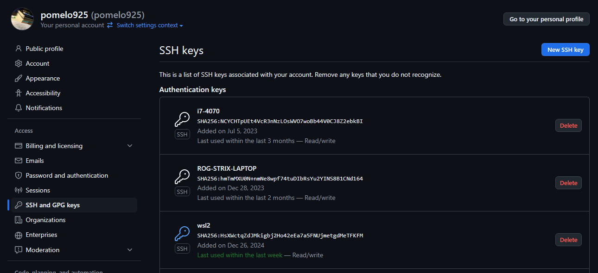
<p align="center">
我的 GitHub 上存取多個不同裝置的 public key。<br>
因此能在不同的電腦上更新我的 repository。
</p>

設定步驟如下：

1. 登入 GitHub
2. 點擊右上角圖示下拉選單 settings
3. 選擇左側欄位 SSH and GPG keys
4. 按藍色的 New SSH Keys。

??? info "設定畫面解釋"
    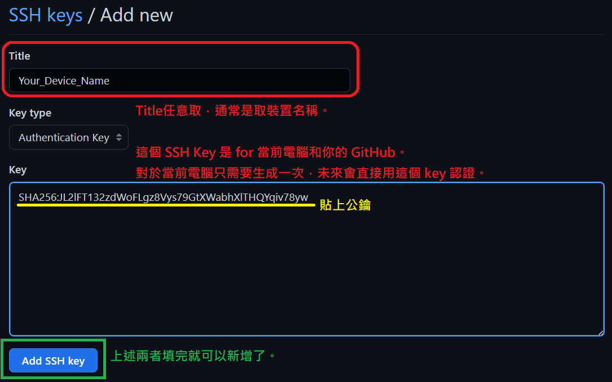
    
!!! example "Checkpoint"
    使用指令 `ssh -T git@github.com` 測試連線，成功後才能繼續往下做。

---

### 1-3. Git → GitHub

在實際操作前，先來釐清 Git 流程和機制吧！

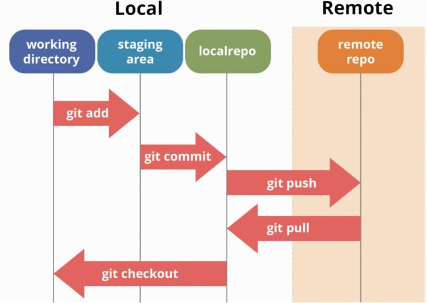{width="600"}

!!! info "本地端 vs. 遠端"

    - Local（本地端）
        - working directory（工作目錄）：實際編輯的檔案位置。
        - staging area（暫存區）：用來暫存準備提交的變更。
        - local repo（本地版本庫）：記錄正式提交的歷史。
    - Remote（遠端）
        - remote repo（遠端版本庫）：例如 GitHub、GitLab 上的倉庫。

**主要指令與流程**

| 指令             | 來源 → 目標                | 主要用途與說明                                                                                   |
|------------------|---------------------------|--------------------------------------------------------------------------------------------------|
| `git add`        | working directory → <br>staging area | 標記要提交的檔案。<br>可篩除不必要的檔案（如編譯檔、權重檔等）。                                      |
| `git commit`     | staging area →<br>local repo | 將變更存入本地版本歷史。<br>需撰寫 commit 訊息紀錄本次修改重點。                                      |
| `git pull`       | remote repo →<br>local repo  | 拉取遠端更新。<br>同步他人修改或讓本地裝置更新至最新版本。                                            |
| `git push`       | local repo →<br>remote repo  | 將本地提交推送到 Github。<br>與遠端同步，讓團隊成員取得你的修改。                                    |
| `git checkout`   | local repo →<br>working directory | 切換分支或還原到某個版本，讓工作目錄回到指定狀態。<br>（暫時不用深入理解）                            |

---

## 2. 工作流（Workflow）

!!! tip
    這裡都會直接使用 VSCode 操作 Git（而不是在 Git Bash 中打指令）。

    VSCode 擴展模組以按鍵代替 git 指令，操作更快速方便、學習也更快。  
    我會提供對應 Git 指令，你也可以選擇在 Git Bash 中輸入，效果相同。

!!! warning
    很多進階用法仍要靠指令完成，所以請不要完全捨棄學習它。

!!! example "Checkpoint"
    在 VSCode 中的 extensions 下載 Git 模組。
---

### 2-1. git Init

> 對應指令：`git init`
    

在 vscode 中的 source control ，進行初始化。

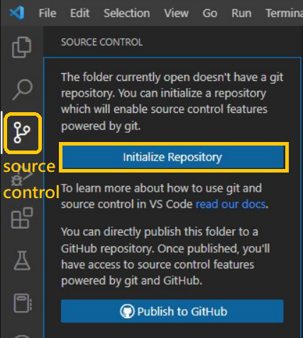{width="350"}


??? Question "沒有 Source Control Icon"
    請檢查是否有安裝 Git，
    以及相關的 VSCode Extensions。

---

### 2-2. git add

> 對應指令： `git add`

新增資料到暫存區 ( Storage Area )。

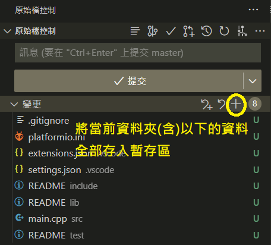{width="380"} 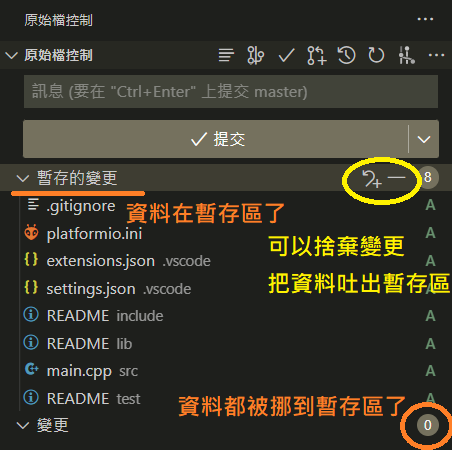{width="350"}

---

### 2-3. git commit

> 對應指令： `git commit -m "your commit msg"`
    
打包一個版本做提交，並寫上 commit 訊息。

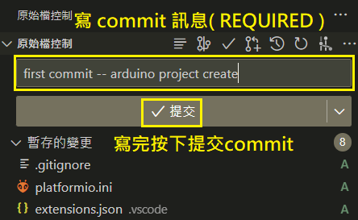

??? Bug "Error: Make sure you configure …"
    
    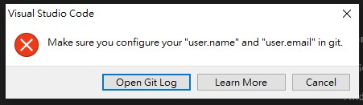
    
    **Solution**
    
    用快捷鍵 `ctrl + ~` 打開終端機，在右上方「+」的下拉選單中選 Git Bash。
    
    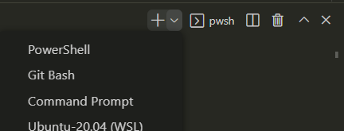
    
    在 Git Bash 中設定 GitHub 的 username 和 email。
    
    ```
    git config --global user.name "MY_NAME"
    git config --global user.email MY_EMAIL@example.com
    
    ```
    
---

### 2-4. publish branch

> 對應指令： `git push --set-upstream origin main`
    
按下「publish branch」建立並發佈分支。

??? info "首次需認證確認"
    
    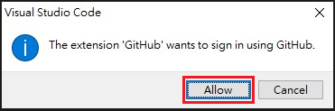
    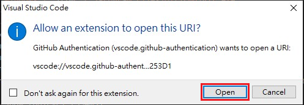
    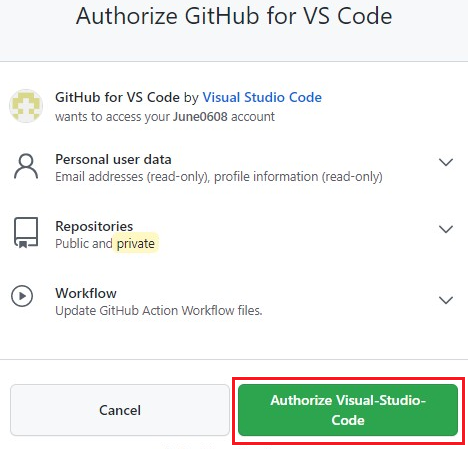
    

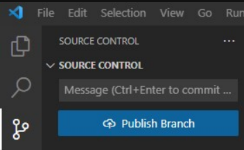

---

### 2-5. create repository

> 對應指令：  
`git remote add origin [username]/[repo].git`  
`git push -u origin master`

選「private repository」，並輸入 repo name。 (自訂)

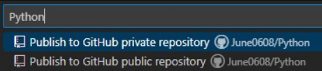


!!! example "Checkpoint"
    發佈 repo 並且能在 GitHub 中找到。
    
---

### 2-6. git pull

> 對應指令：`git pull -u origin master`

1. 在 GitHub repo 頁面中新增 README。  
`README.md` 通常以 markdown 撰寫，說明有關於此 REPO 的資訊。
    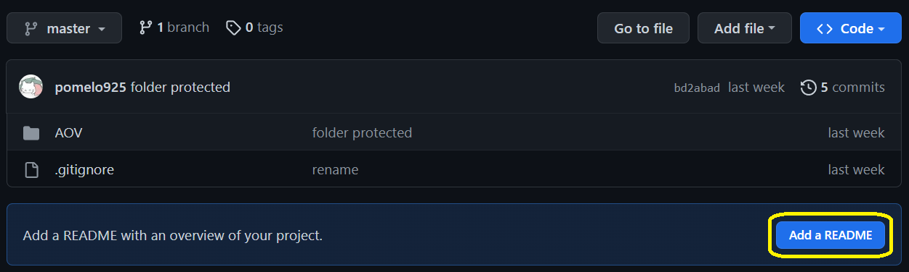

    ??? info "README.md example"
        
        ```py
        # Python
        ---
        This is a sample for readme file.1
        ```

    !!! info "目前情況"
        注意 commit 完後，現在遠端的 GitHub Repo 是新版本。  
        所以現在須要進行 `git pull`，更新本地端使其與遠端同步。

2. 本地端提取新版本。  
到「source control」的右側「…」，
選擇「提取」。

    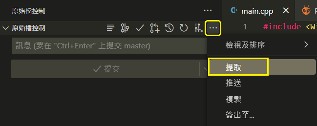


在多人合作時，隊友會不定期使用 `git push` 更新專案項目。  
而我們也要定時 `git pull` 更新專案，確保彼此是基於同個版本之上開發。

但通常不會直接在同個 branch 上開發，這裡先有個概念即可。

!!! example "Checkpoint"
    確認在 local repo 中出現 README.md.

----

### 2-7. git push

> 對應指令：`git push origin main`

1. 更改本地端資料：新增檔案 hello.txt，並隨便打幾個字。

2. `git add` 並 `git commit`。

    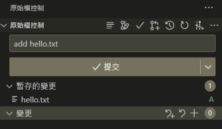

3. `git push`：按下「同步變更」就能夠成功 push 上去囉！

    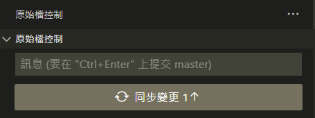


!!! info "Sync（同步變更）" 

    今天在雲端新增 readme 後，假設我們沒有 git pull 下來；  
    同時間我又在本地端新增了 hello.txt 檔案，這樣會出現本地和遠端版本不一致。

    同步變更其實就是先 `git pull` 再 `git push`。  
    事實上，Github 規定在 push 之前必須更新到和雲端版本相同。  
    必要時是可以透過 `-f` 來強制推送（並覆蓋檔案），但不推薦用除非你知道在做啥。

!!! Tip "總結"
    
    至此，我們已經跑過一遍完整的開發流程。  
    從本地建立 Local Repo，上傳到 Github，並且模擬開發中的 `pull` 和 `push` 過程。  
    
    個人更新，要維持習慣天天更新 Repo，紀錄工作進度同時也做了備份。  
    團隊更新，會須要更多 Git 知識，請繼續跟著章節學習！


!!! example "Checkpoint"

    檢查 GitHub Repo 上是否有出現新增檔案，並且自己再試幾遍去熟悉流程。

---

### 2-8. git clone

> 對應指令：`git clone [repo_url]`

透過 `git clone` 指令，能速載任意的 Public Repo 或自己的 Repo。 

1. 首先複製自己 repo 的網址。
    
    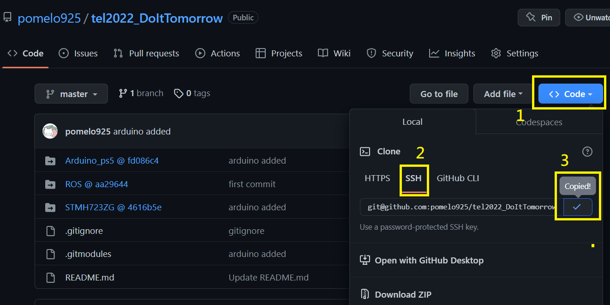
    
    !!! info "SSH vs. HTTPS"

        有存取權限的 Repo 請使用 SSH 網址，比較安全。（盡量都用 SSH）  
        沒有的話就用 https 做 git clone。
    

2. 開 Terminal 並 Git Clone。

    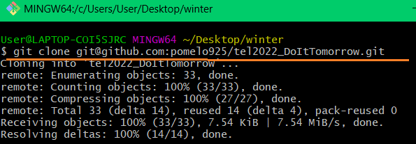

!!! example "Checkpoint"

    學會使用 git clone。

---

## 3. Git Flow & GitHub Flow

> Git Flow 是使用 Git 進行團隊開發時的流程規範與策略。  
幫助多人協作、降低衝突、維護乾淨的專案歷史。

這只是一種思想和概念，不是一套嚴謹的實際規範或流程。  
多看 GitHub 開源專案，能學習到大團隊是如何管理的。


### 3-1. git branch

> 在開始 Git Flow 與 GitHub Flow 前，需要先熟悉 git branch 功能。

Branch（分支），能讓你在不影響主線 (`main`) 的情況下進行實驗、開發新功能。  
預設分支通常為 `main` 或 `master`。

這裡想先說明幾點：

- 同個 repo 的 `branch` 之間的版本往往是不一致的。  
例如團隊開發中，以人名為命名的 `branch` 上，有各自組員的新進度。  
又或是緊急修復或實驗測試時，臨時新開的 `hotfix` 分支。  
通常這些分支相對於 `main` 的版本會是更新的。
- `branch` 一樣有分 local 和 remote。  
在本地新增 branch 後，須 `git push` 才會在 GitHub 上看到分支。  
同理若於 GitHub 上新增分支，須 `git pull` 才能在本地端看到新分支。  
- `git push` 一次只能發佈一個 `branch` 的更新。
- 團隊開發中，理應定期開會並合併代碼，對不同的 `branch` 做 `git merge`。  
`git merge` 階段，要確認彼此的程式碼沒有衝突。
- `git clone` 會將所有分支的資料都 clone 下來，但只顯示預設分支。  
因為同一時間只能在一個分支上作業，切換分支需要手動做 `git checkout`。

??? tip "Git Branch 指令集"

    - 查看分支
        
        ```python
        git branch        # 列出本地所有分支
        git branch -r     # 列出遠端分支
        git branch -a     # 列出所有（本地 + 遠端）分支
        ```
        
    - 新增分支
        
        ```bash
        git branch new-feature       # 建立新分支（不切換過去）
        git checkout -b new-feature  # 建立並切換到新分支
        ```
        
    - 切換分支
        
        ```bash
        git checkout main         # 切換到 main 分支
        git switch new-feature    # 使用 git 2.23+ 新指令
        ```
        
    - 刪除分支
        
        ```bash
        git branch -d branch-name     # 刪除分支（已合併）
        git branch -D branch-name     # 強制刪除（未合併也可）
        ```
        
    - 合併分支
        
        ```bash
        git checkout main
        git merge new-feature         # 將 new-feature 合併進 main
        
        ```
        
    - 推送分支到遠端
        
        ```bash
        git push origin branch-name        # 推送本地分支到遠端
        git push -u origin branch-name     # 並設定上游分支
        ```
        
    - 取得遠端分支
        
        ```bash
        git fetch                         # 抓取所有遠端分支更新
        git checkout -b local-name origin/remote-name
        ```
    
!!! example "Checkpoint"

    在 local repo 中新增不同 branch，熟悉在不同的分支上開發，並 push 到 Github。  
    並且善用 VSCode extensions，如透過 GUI 換 branch、看 Git log。  
        
    範例：過去團隊比賽的紀錄，以人名為命名的 branch 各自開發並定期 merge。  
    透過 Git Extensions 可以清楚觀看開發紀錄。
            
    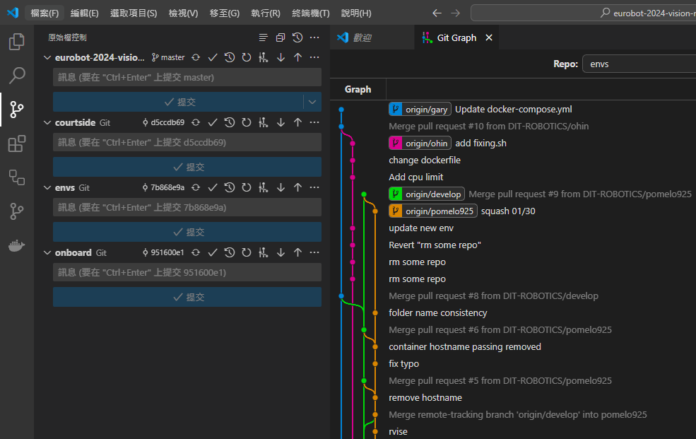
        
---

### 3-2. git flow

> Git Flow 是歷史悠久且廣泛被使用的一種版控流程。  
顧名思義，GIt flow 僅需 Git 工具就能實現。與之對應的有 GitHub Flow。

大概知道 git flow 形式即可，現在大多都走 github flow。  
專案中會有兩個長期存在的分支，分別為主分支 **`Master`** 以及開發分支 **`Develop`**。

- **`Master`**：用於存放對外發布的版本。此分支上發佈的版本都應該是穩定的。
- **`Develop`**：用於存放最新的開發版本。

再來還有三種短期（臨時性）分支。  
開發完就被 `merge` 進 `develop` 或 `master` 並刪除。

- 功能分支（feature branch）
- 修復分支（hotfix branch）
- 預發分支（release branch）

---

### 3-3. GitHub Flow (fork & PR)

> GitHub Flow 能在部署上自動化，如一天之類需要多次部署的開發（持續發布）。  
GitHub 比 git 多兩個服務，`fork` 及 `pull request`（簡稱 `PR`），還有 issue tracking 等。

首先是 `fork`，類似於 `clone`，會將他人的 repo 複製一份到自己的 GitHub 上。  
並且將你複製的與原 repo 建立連結。

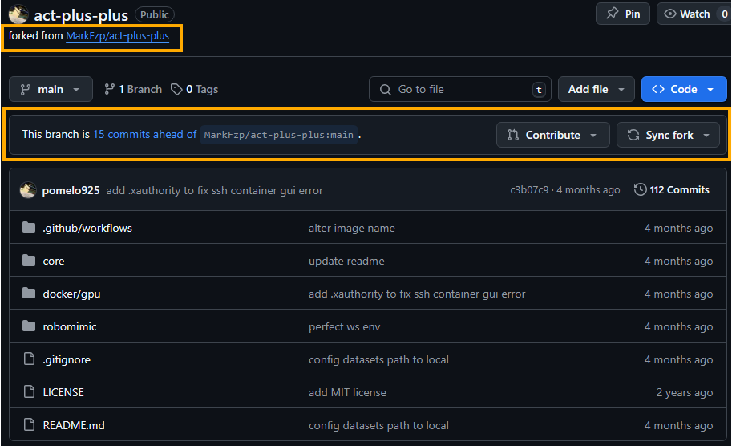

你可以在你複製的那份任意修改，完全不會影響到原作。  
假如今天你對複製在你個人 GitHub 上的那份 repo 做了功能修復，並想貢獻給原作者。  
這時就可以透過 GitHub 上面的 GUI 去丟 PR，毋須指令操作。  
原作者會收到通知，由他確認是否同意你的  PR。

!!! info "Pull Request (PR)"

    `Pull Request`，意思是 request 對方 `git pull` 你的 `git commit`。  
    本質上就是在請求 `git merge` ，只是多了一種貢獻關係。


除了 fork repo 可以對原作丟 PR 之外。 
即便是在同一個 repo 中，不同的 branch 之間也能在 GitHub 上做 PR 的。
例如 `hot-fix` 分支請求 `release` 分支合併它新增的緊急修復補包。

!!! successs ""

    現在考慮一個場景吧！

    我們現在共同維護著實驗室網站 `labpage_repo`。  
    正式發佈的版本為 `release` 分支，網管為 `alan`，並加入新成員 `pomelo925`。

    若 `pomelo925` 想要在 `labpage_repo`上新增其個人檔案，可以怎麼做？  
    這裡提供兩種比較正規的做法，Fork 版本與 Branch 版本。

    - Fork 版本（適用於當 `pomelo925` 沒有 `labpage_repo` 的存取權限）
        1. `pomelo925` 將 `labpage_repofork` 到個人 GitHub 上，名稱為 `fork_labpage_repo`。
        2. `pomelo925` 在 `fork_labpage_repo` 上新增了 925 行程式碼並測試無誤。
        3. `pomelo925` 在 GitHub 上對 `labpage_repo` 丟 PR，請求代碼合併。
        4. `alan` 收到通知，測試沒問題後同意 `PR` ，將修改合併到分支 `release` 中。

    - Branch 版本 （適用於當 `pomelo925` 擁有 `labpage_repo` 的部分存取權限）
        1. `pomelo925` `git clone` `labpage_repo` 到本地端。
        2. `pomelo925` 在本地端建立並 `git push` 分支 `pomelo_dev`。
        3. `pomelo925` 在丟了 925 次的 commit 後，覺得很完美了。
        4. 因為分支 `release` 被設定成只有網管 `alan` 擁有修改權限。
        於是 `pomelo925`  決定在 GitHub 上對分支 `release` 丟 `PR`。
        5. `alan` 收到通知，測試沒問題後同意 `PR` ，並將修改合併到分支 `release` 中。
        6. 此時分支 `release` 和 `pomelo_dev` 版本一致，可以刪除分支 `pomelo_dev` 。

!!! example "Checkpoint"

    1. 在自己的 repo 中，對 `main branch` 丟 `PR`，並自己同意請求。  
    ( 除了熟悉操作、介面外，也可以多多測試，合併檔案衝突時要怎麼處理)
    2. 類似的流程，但改成 fork 自己的專案，並向自己丟 `PR`。

---

## 4. 子模組（Submodule）

> Git Submodule 是 Git 的一個功能。  
用來在一個 Git 倉庫（主專案）中引用另一個 Git 倉庫（子專案），
讓你能夠把外部專案（例如：library、工具、模組）直接嵌入到你的專案中，
但又能保持它們的版本獨立管理。


如下圖範例，點擊 submodule 後會跳轉至對應的 GitHub Repo。( [連結點我](https://github.com/pomelo925/tel2022_DoItTomorrow) )

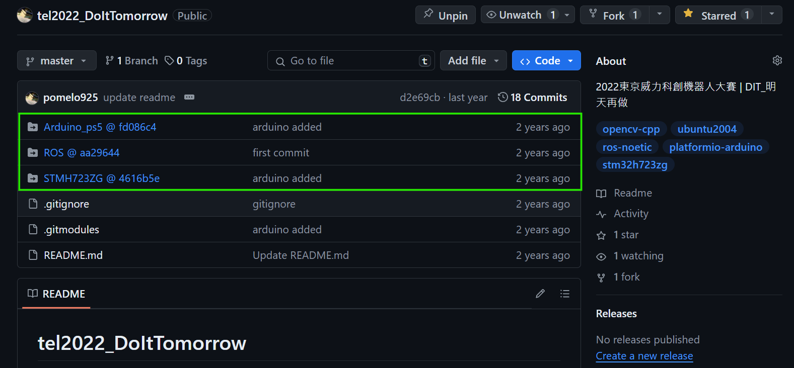

---

### 4-1. 建立父子模組關係

> 前情提要：
在 GitHub 上有兩個 repository,  `parent_repo` & `child_repo`。  
可以新建兩個, 或直接用現成的。

現在要將 `parent_repo` 以 submodule 的方式連結 `child_repo`。

1. Navigate 到 `parent_repo` 的根目錄。

2. 建立子模組關係。（此指令包含 `git clone` 的作用）
    ``` yaml
    # <child_repo>：子模組 child_repo 的 URL。
    # <local path>：子模組相對於父模組的路徑位置。
    #               資料夾名稱會會是 github 上 submodule 的名稱前綴。
    
    git submodule add <child_repo> <local path>
    ```

    ??? info "範例"
        
        ```yaml
        # example

        git submodule add git@github.com/DIT-ROBOTICS/eurobot-2024-vision-courtside.git courtside
        git submodule add git@github.com/DIT-ROBOTICS/eurobot-2024-onboard-cam.git onboard
        ```
        
        資料夾結構如下所示：
        
        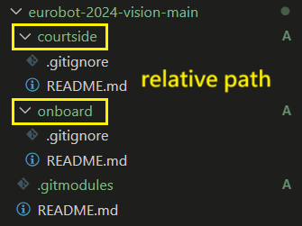 

3. 確認在 `parent_repo` 根目錄的 source control 中，會新增兩個檔案。
    
    ??? info "範例"
        
        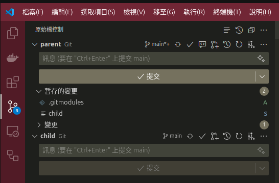 
        
        - `.gitmodules`：自動生成的定義 submodule 關係的文件。
        - `child_repo`：指定的子模組資料夾。它在 Git 的追蹤中是作為一個特殊的 commit pointer。  
        在 `parent_repo` 的 Git Commit 中，子模組是以一特定的 commit SHA 記錄的，而不是整個目錄內容。

4. 將這些變更打包並 `git push` 到 GitHub 上。

!!! example "Checkpoint"

    成功建立 submodules，並呈現於 GitHub 中。

---

### 4-2. Submodule Pointer

以下是 `parent_repo` 和點擊 `child_repo` 後的 submodule 截圖。

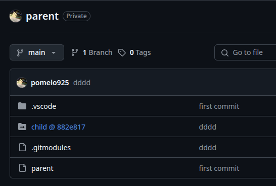{width="400"} 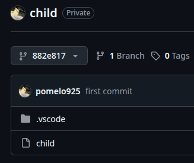{width="320"}

從截圖中我們可以知道：

- `parent` 位於 `main` branch 上。
- submodule 紀錄的是 commit 版本，在 `@` 後方的就是版本的流水碼。
- 導向的 `child` submodule，並不是位於 branch 上， 而是特定的 commit `882e817`。
- 可以透過下拉選單，切換成 `main` branch，查看 `child` 最新的版本。

    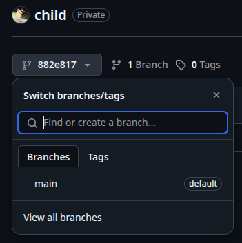


即便 submodule 在 `main` branch 持續更新，若 `parent` 沒有更新 commit pointer。  
那麼 parent 上的 submodule 依舊會是過去的某個版本。

---

### 4-3. 更新子模組

> 當 `child` 更新時，我們需要更新 `parent` 中導向 `child` 的 commit pointer 。

假設 `child` 已經做了更新：

1. 移至 `parent` 的根目錄，輸入 `git status` 確認 commit pointer 為 `modified`。
    
    ``` py
    On branch main
    Your branch is up to date with 'origin/main'.
    
    # ...
    modified:   child (new commits)
    # ...
    ```
    
2. 跑一遍 add→ commit→ push 即可。

!!! example "Checkpoint"

    成功更新子模組，並使用 VSCode 的 GUI 來加速操作。

---

### 4-4. 新增子模組

日後要新增子模組的步驟：

```python
cd <root_folder>
git submodule add <submodule_url> <path>
git submodule update --init --recursive

git commit -am "add: repoB submodule"
git push
```

---

## 5. GitHub Action

!!! abstract

    GitHub Actions 是 GitHub 提供使用者自訂 Repo 內的 CI/CD (自動化流程)。


### 5-1. Docker Image 自動流程

!!! abstract

    最常用的服務之一，是建立「Docker Image 自動構建並發佈到 Docker Hub」的自動化流程。
  
這部份可以等學完 Docker 再回來學！

設定步驟：

1. 在 repo 的根目錄中新增 `.github/workflows`。  
這是專門用來放置 GitHub Actions 的工作流程設定檔（Workflow files）。  
GitHub 官方會在 repo 裡自動尋找 `.github` 資料夾中的內容，因此檔名不能亂改。

2. 在 `.github/workflows` 中自定義 workflows 的 yml。( e.g `docker-image.yml` )  
    
    ??? tip "action yml 範例"

        比較須要更改的部分有用 `##` 標註。  
            
        ``` yaml
        name: VIPERX 300S image (x86)
        
        ## on：設定會觸發自動化工作流程的事件
        ## 這裡希望只有當 docker 相關檔案被 git push 時, 才會觸發 CI/CD
        on:
        push: 
            branches: [ main, pomelo925 ]
            paths:
            - ros2/docker/Dockerfile
            - .github/workflows/docker.yml
        
        ## jobs：定義工作內容
        jobs:
        docker:
            runs-on: ubuntu-latest
            steps:
            # Initialization
            - 
            name: Repo Checkout 
            uses: actions/checkout@v4
            - 
            name: Docker meta
            id: meta
            uses: docker/metadata-action@v5
            ## 指定 docker image 的 name:tag
            with:
                images: ${{ secrets.DOCKERHUB_USERNAME }}/viperx-300s
                tags: default
            # Login Docker Hub
            - 
            name: Docker Hub Log-in
            uses: docker/login-action@v3
            with:
                username: ${{ secrets.DOCKERHUB_USERNAME }}
                password: ${{ secrets.DOCKERHUB_ACCESS_TOKEN }}
        
            # Build Docker image
            - 
            name: Build Docker image
            uses: docker/build-push-action@v6
            with:
                context: ros2/docker  ## 指定 docker 資料夾路徑
                load: true 
                tags: ${{ steps.meta.outputs.tags }}
                push: false
                no-cache: true
        
            # Push Docker image to registry
            - 
            name: Push Docker image
            uses: docker/build-push-action@v6
            with:
                context: ros2/docker   ## 指定 docker 資料夾路徑
                push: true
                tags: ${{ steps.meta.outputs.tags }}
                no-cache: true
        ```
        
3. 在 GitHub 上設定僅限此 repo 讀取的 secrets 金鑰。  
儲存 Dockerhub 的 username 及 token。
    
    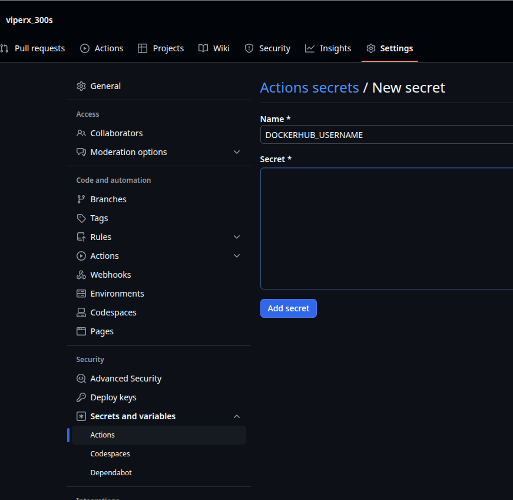{width="650"}
        
4. `git push` 後到 GitHub 上檢查是否開始運行 GitHub Action。

    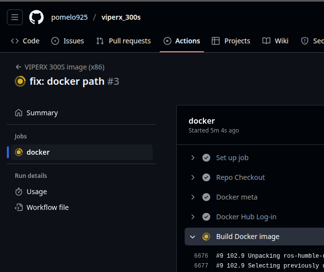{width="650"}
        
5. 在 VSCode 載入 GitHub Actions 套件，也能看到遠端的進度。

    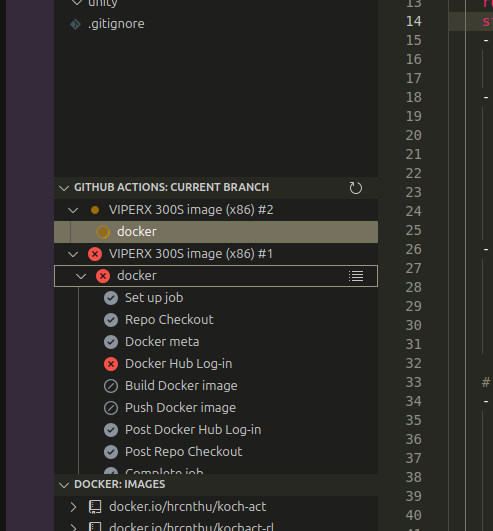