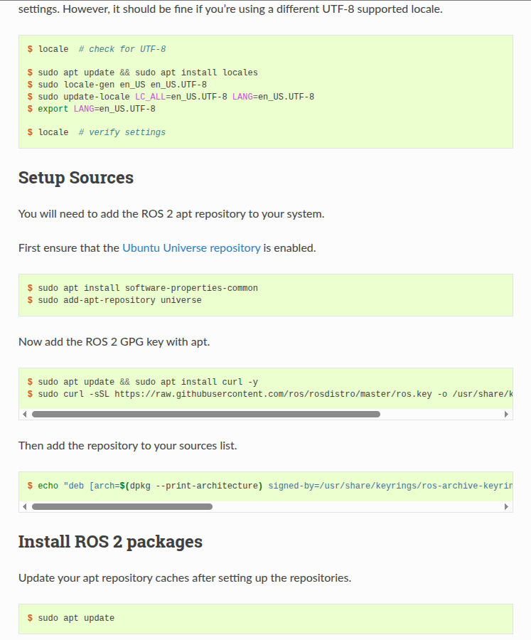
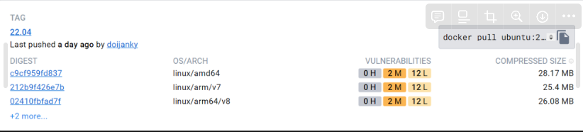
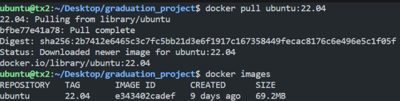
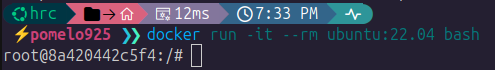
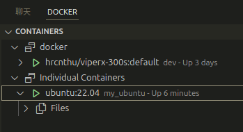
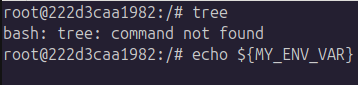
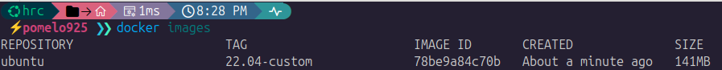

# Docker

!!! abstract "Docker"
    
    Docker 是一種軟體平台，讓開發者能快速地建測試和部署應用程式。

## 1. 學習 Docker 之前

所有的軟體開發或使用第一步，是建立好環境。  
而 Docker 是目前使用度最廣泛的環境建置工具。

!!! info "環境"
    所謂環境，其涉及的範圍可以從底層的硬體架構(x86, ARM)、作業系統(Linux, Windows)、CPU/GPU 型號，    
    到上層的驅動程式、Python 版本，或 ROS2 packages 等各種軟體工具。

---

### 1.1 設定環境比 Coding 困難?

> 環境設定有多麻煩呢？  
文章賞析：[Does anyone else feel like setting up environments is harder than actually programming?](https://www.reddit.com/r/learnprogramming/comments/smech6/does_anyone_else_feel_like_setting_up/)

假想場景：  
實驗室要開發一個基於 C++ 的 ROS2 package，它內部實作使用到 Lambda 語法。  
我們知道 Lambda 可以被 `C++11` 編譯器識別，但舊版的 `C++ 98/03` 不行。

因此每次在新機器測試程式碼時，我們要先設定好 C++ 編譯器。  
同理包含解決各種 python package 衝突, 確認 Ubuntu 版本, CUDA version 等等。

這之間經常會遇到版本不相容、無法調用編譯器、忘記安裝某依賴項目等問題。  
另外，每當同台機器要運行不同版本的程式碼，就要切換編譯器，相當麻煩。  

很快地，下一章節是學習 ROS2。  
假如現在規定使用 ROS2 Humble 開發，我們來看看差異：

- 不使用 Docker
    1. 電腦必須灌 Ubuntu 22.04 OS。
    若系統為 20.04 或 24.04，只能放棄或重灌。
    2. 接著參考官網的 [ROS2 安裝步驟](https://docs.ros.org/en/humble/Installation/Ubuntu-Install-Debians.html)。

        ??? note "示意圖"
            
            
- 使用 Docker
    1. 電腦安裝 Docker。
    2. 輸入終端機指令 `docker run -it --rm osrf/ros:humble-desktop-full bash`。

!!! tip "小提示"

    Docker 環境建置快速，但更重要的是提升安全性。  
    使用 Docker 能隔離於本地環境，其餘細節後面會提到。

!!! example "Checkpoint"

    安裝好 Docker，並且知道不能不學 Docker。

---

### 1.2 Docker 開發架構

> Docker 的架構和早期虛擬機如 VMWare 等完全不同。  
有興趣的可以自行查資料補充知識。

這是 Docker 的開發流程示意圖：

{width="600"}

| 名稱                | 說明                                                                 |
|---------------------|----------------------------------------------------------------------|
| **Dockerfile**      | 環境配置文件。</br>在 Dockerfile 中宣告要安裝哪些資源以及設定環境變數。      |
| **Docker Image**    | 映像檔。</br>根據 Dockerfile 所建構 (build) 出來的軟體環境。                |
| **Docker Container**| 虛擬容器。</br>Container 是基於 Image 所執行 (run) 的一個實體應用。         |

幾個要點：

- Dockerfile 構件成 Image 時，會使用到 CPU 資源。
- 一個 Image 可以 run 多個 Container，每個 Container 之間可以是獨立的。
- 在 Container 中的操作與宿主機 (host) 是隔離的。  
所以你可以在 Container 中隨意測試，環境炸掉就把容器 remove 即可。

---

## 2. Docker 開發流程

!!! tip 實際演練

    先跑一次 Docker 的實際開發流程。  
    對整體架構有概念後，我們再回頭來學每個過程的細節。


接下來，會跑以下步驟，實際演練一下開發流程。

1. 將官方 ubuntu 22.04 的 Docker Image `docker pull` 到本地端。
2. 執行 `docker run`，建立一個基於官方 Docker Image 的 Docker Container 。
3. 在 Container 中測試搭建新環境，並紀錄於 `Dockerfile` 。
4. 根據修改完的 `Dockerfile` 去 `docker build` 出新版 Docker Image。  
並執行基於新版 Image 的 Container，測試新環境。
5. 將新版 Docker Image  `docker push` 到 Docker Hub 上。

!!! example "Checkpoint"

    註冊 Docker Hub。

---

### 2-1. docker pull

> 將官方 ubuntu 22.04 的 Docker Image `docker pull` 到本地端。


1. 下載 Ubuntu Image：`docker pull ubuntu:22.04`。

    ???+ info "docker pull 細節"

        執行 `docker pull` 時系統會去找被存儲在 [Docker Hub](https://hub.docker.com/_/ubuntu) 上的 Image。  

        

    ??? warning "arch 不相容性"

        注意 Image 在不同 ARCH 間是不相容的。  
        例如 AMD64 不可使用 ARM 架構 build 出來的 Image，反之亦然。
    
    ??? note "示意圖"
        
        
        
2. 檢查映像檔：`docker images`（ 形式是 `username/repository:tag` ）。

!!! example "Checkpoint"
    
    確認自己電腦的架構，並成功 pull image

---

### 2-2. docker run

> 執行 `docker run`，建立一個基於官方 Docker Image 的 Docker Container。

1. 運行容器指令： `docker run -it --name my_ubuntu ubuntu:22.04 bash`
    
    ??? note "示意圖"
        
        範例中 Container 的使用權限為 `root`，Container ID 為 `8a420442c5f4`。  

        
    
    | 參數 | 說明 |
    | --- | --- |
    | `docker run` | 建立並啟動一個新的 container |
    | `-i` | （interactive）讓容器保持標準輸入開啟，允許互動 |
    | `-t` | （tty）分配一個虛擬終端機，讓你有一個像真的 shell 環境 |
    | `--name my_ubuntu` | 幫這個 container 取一個自訂名字叫 `my_ubuntu`，方便之後操作 |
    | `ubuntu:22.04` | 使用的 image 是 `ubuntu`，版本是 `22.04`（即 Jammy Jellyfish） |
    | `bash` | 啟動容器後要執行的指令：這裡是 `/bin/bash`，讓你進入 shell |
    
    注意事項：
    
    - 跑 `docker run` 時，系統會先找本地是否有此 Image。  
    若無則去 Docker Hub 上找並自動 `docker pull`。
    - 終端機前綴改變，代表進入 Container 的環境內。  
    現在於終端機輸入的指令，作用範圍都僅限於 Container。


2. 容器操作：
    
    
    | 操作 | 指令 | 備註 |
    | --- | --- | --- |
    | 離開但保持 container 運行 | `Ctrl + P` → `Ctrl + Q` | 不會中斷 container 運行 |
    | 離開並停止 container 運行 | `Ctrl + D` | 相當於登出並關閉 container |
    | 查看所有 container | `docker ps -a` | 顯示運行中與已停止的 container |
    | 重啟 container | `docker start my_ubuntu` | 重啟停止運行的 container  |
    | 重新進入 container | `docker attach my_ubuntu` 或 `docker exec -it my_ubuntu bash` | 僅適用於已運行中的 container |
    | 停止 container | `docker stop my_ubuntu` | 將 container 停止運行 |
    | 刪除 container | `docker rm my_ubuntu` | 完全終止 container |

!!! example "Checkpoint"

    1. 在 Container 中可以輸入 Docker 相關指令嗎？為什麼？
    2. 使用 VSCode Extensions - Remote Developer, Docker 加速操作。
        
        ??? info "示意圖"
                        
            常用功能：
            
            - 一覽所有 Container 狀態
            - 一覽個別 Container 的 Files，此為容器內資料夾目錄
            - 對 Container 點擊右鍵，選 Attach Shell 可直接進入終端
            - 對 Container 點擊右鍵，使用 stop, restart 以及 remove

            

---

### 2-3. dockerfile

> 在 Container 中測試搭建新環境，並紀錄於 `Dockerfile`。 

1. 在 Container 中，測試指令 `tree` 以及 `echo ${MY_ENV_VAR}`。
    
    

2. 在 Container 中，安裝 `tree` 以及設定環境變數。
    
    ``` bash
    apt update && apt install tree
    export MY_ENV_VAR=I_LOVE_DOCKER
    ```
    
3. 在 Container 中，再測試一遍指令：`tree` 以及 `echo ${MY_ENV_VAR}`。  
顯示的輸出結果如預期，代表第 2 步的環境設定是沒問題的。

4. 在 Host 中，任意資料夾中新增檔案，檔名為 `Dockerfile`。  
    Dockerfile 的語法其實很直觀，詳細教學會留到下章節。
    
    ```docker
    # 基於哪個已存在的 Image 檔案建置環境
    FROM ubuntu:22.04
    
    # 設定環境變數
    ENV MY_ENV_VAR=I_LOVE_DOCKER
    
    # 安裝 tree
    RUN apt update && apt install tree
    ```

---

### 2-4. docker build

> 根據修改完的 `Dockerfile` 去 `docker build` 出新版 Docker Image。  
並執行基於新版 Image 的 Container，測試新環境。

1. 在 Host 中，瀏覽至 Dockerfile 所處資料夾，輸入構建指令。
    
    ``` sh
    docker build -t ubuntu:22.04-custom --no-cache .
    ```

    | 參數 | 意義 |
    | --- | --- |
    | `docker build` | 建立一個 Docker 映像檔（image） |
    | `-t ubuntu:22.04-custom` | `-t` 是 `--tag` 的縮寫，為建構出的 image 命名為 `ubuntu:22.04-custom` |
    | `--no-cache` | 在建置過程中不使用任何快取，
    每一層都會重新執行</br>（避免使用舊的快取） |
    | `.` | 告訴 Docker 以當前目錄作為建置上下文（build context），</br>系統會自動尋找名為 `Dockerfile` 的文件 |

2. 建構完成後，使用 `docker images` 檢查。
    
    ??? note "示意圖"
        
        

3. 測試新環境：`docker run -it --name my_ubuntu_custom ubuntu:22.04-custom bash`

4. 輸入測試指令 `tree` 及 `echo ${MY_ENV_VAR}` ，檢查新環境是否輸出預期結果。

!!! example "Checkpoint"

    1. 充分理解為何 `ubuntu:22.04-custom` 能直接運行 `tree` 及 `echo ${MY_ENV_VAR}`。
    2. 能再新建一個 `Dockerfile`，其 base image 為 `ubuntu:22.04-custom` 嗎? 需要注意什麼?

---

### 2-5. docker push

> 將新版 Docker Image  `docker push` 到 Docker Hub 上。

1. 登入 docker 帳號 (輸入username/password)
    
    ```docker
    docker login
    ```
    
2. 修改 tag 以符合上傳標準 (修改後可到 `docker images` 查看)
    
    ```docker
    # image name : USERNAME/REPOSITORY:TAG
    docker tag ubuntu:22.04-custom [username]/ubuntu:22.04-custom
    ```
    
3. 推送到 Docker Hub
    
    ```docker
    docker push pomelo925/ubuntu:22.04-custom
    ```
    
!!! example "Checkpoint"
    1. 到 Docker Hub 上確認是否有 Docker Image。
    2. 刪除本地端多餘的 Docker Image Tag，可學習用 `prune` 指令。
    3. 刪除 `[username]/ubuntu:22.04-custom`，並重新 docker pull 檢查是否順利。

未來要在其他機台使用此環境，就能直接 docker pull 此 Docker Image。  
省去重新建置環境的麻煩！

---

## 3. Dockerfile

> 一些範例：[act-plus-plus](https://github.com/pomelo925/act-plus-plus/blob/main/docker/gpu/Dockerfile)、[TTennis-Pickup-Robot](https://github.com/pomelo925/TTennis-Pickup-Robot/blob/main/3.Software/C.EdgeNN/docker/Dockerfile)


!!! abstract "Dockerfile 學習目標"

    Dockerfile 的基本功能是安裝依賴項目及環境參數。  
    但減少容量和提升安全性也是非常重要的兩項工作。


因為 Docker 和 Compose 的學習會在有目標後，比較有方向應該怎麼做。  
因此以下部分可先過目，先知道有哪些東西要學後，未來再來邊看邊學。

### 3-1. 基本語法

---

這裡放上幾個比較常用的 Docker 指令。當作工具書看就好。  
其他沒提及的指令大部分都會在 Docker Compose 中宣告。

| 指令 | 說明 |
| --- | --- |
| `LABEL` | 提供 image 的中繼資訊（例如維護者、版本、說明）。 |
| `FROM` | 設定 base image，可用多個 `FROM` 來建立不同的建構階段（Stage）。 |
| `RUN` | 執行 shell 指令，每個 RUN 會建立一層 Layer。 |
| `SHELL` | 自訂 RUN/ENTRYPOINT/CMD 所使用的 shell，例如 `["bash", "-c"]`。 |
| `ARG` | 建構階段使用的變數（不能在 container runtime 使用）。 |
| `ENV` | 設定環境變數，可供後續指令或應用程式使用。 |
| `COPY` | 將檔案從 build context 複製進 image。支援 `--from=stage` 用於 multi-stage build。 |
| `USER` | 指定後續指令與執行程序所使用的使用者。預設為 root。 |
| `WORKDIR` | 設定工作目錄（自動建立目錄）。 |
| `ENTRYPOINT` | 設定容器啟動時的主要執行指令，**通常搭配 CMD 提供參數**。 |

ARG 和 ENV 都是設定環境變數的指令。以下是差異：

| 項目 | `ARG` | `ENV` |
| --- | --- | --- |
| 定義時間 | **建構階段（build-time）變數** | **建構+執行階段（runtime）變數** |
| 可否跨 Stage | 預設無法跨 ****Stage | 可跨 Stage 繼續使用 |
| 是否進入 Image | 不會寫入 image，僅供建構用 | 會寫入 image，執行容器時仍可存取 |
| 安全性 | 比較安全，不會出現在最終 image 中 | 若含密碼等資訊，會被寫入 image |
| 用途 | 控制建構流程（例如安裝選項、版本等） | 提供應用執行所需參數或路徑設定 |

---

### 3-2. Image layer 概念

幾個知識點：

- `Dockerfile` 中的每個指令（例如 `RUN`, `COPY`, `ADD`）都會建立一層 layer。
- Docker 會對每個 layer 做「快取（cache）」處理，避免重複建構， 節省時間。
- layer 越多容量越大。所以我們會將相同類型的操作，合併到一個指令，以縮減容量。

範例：

``` docker
## Example
FROM ubuntu:22.04 

# 安裝指令(使用一個 RUN 指令)
RUN apt update && apt install -y \
    build-essential \
    cmake \
    git \
    && rm -rf /var/lib/apt/lists/*
```

!!! question "`rm -rf /var/lib/apt/lists/*` 作用 ?"

    當執行 `apt update` 時，系統會下載套件清單並暫存到 `/var/lib/apt/lists/` 資料夾中。  
    這些快取檔案是用來告訴系統哪些套件可用、版本、來源等資訊。

    套件安裝完成後，就不需要這些套件索引清單了。  
    所以刪除它們，以縮減一個 Image layer 的容量大小。

    這是最基礎的減肥方法！

!!! example "Checkpoint"

    了解 Dockerfile 中 `\` 和 `&&` 的用法。

---

### 3-3. user

預設 Docker 容器內的操作會以 **`root`** 執行，容易有安全風險。

雖然理論上容器是隔離於本地端的，但未來在 Docker Compose 中我們會配置許多參數，  
開放部分權限或甚至共享檔案給容器，以方便開發用。

``` docker
## Example
# 環境變數
ARG USERNAME=hrc
ARG USER_UID=1000
ARG USER_GID=$USER_UID

# 創建 UID 1000 的 USER
RUN groupadd --gid $USER_GID $USERNAME && \
    useradd --uid $USER_UID --gid $USER_GID -m $USERNAME && \
    apt-get update && \
    apt-get install -y sudo && \
    echo "$USERNAME ALL=(ALL) NOPASSWD:ALL" > /etc/sudoers.d/$USERNAME && \
    chmod 0440 /etc/sudoers.d/$USERNAME && \
    rm -rf /var/lib/apt/lists/*

# 切換成 User 身分 (作用範圍包含後續的構建階段和最終的容器啟動)
USER $USERNAME
```

---

### 3-4. 多階段構建

!!! abstract "多階段構建（multi-stage build）概念"

    Multi-stage build（多階段建置）是 Dockerfile 的一種強大減肥功能，  
    主要用途是分離建構環境與執行環境，並降低映像檔大小。

Stage 概念

- 是指一份 Dockerfile 裡使用多個 `FROM`。
- 語法為 `FROM Stage_A AS Stage_B` 。  
其中 `Stage_A` 是前一個階段，下個階段則為 `Stage_B`。

    !!! tip "用 Multi-Stage 語法明晰 Dockerfile 結構"

        即使沒有使用 Multi-Stage Build 功能，也可以單純將 Stage 語法作為標誌，表示各安裝過程的階段。

通常的流程是：

1. 先 `FROM base AS building`
    1. 在 `building` 階段，安裝編譯工具。
    2. 對文件進行編譯。
2. 再 `FROM base AS release`
    1. 在 `release` 階段，拷貝 `building` 階段編譯出的執行檔。
    2. 由於 `release` 階段始於 `base` 階段，因此不會有 `building` 階段中安裝的編譯工具。

```docker
## Example
# ===== Stage 1: Build Stage =====
FROM ubuntu:22.04 AS builder

RUN apt-get update && apt-get install -y \
    build-essential \
    cmake \
    && rm -rf /var/lib/apt/lists/*

# 複製原始碼
COPY main.cpp /app/main.cpp
WORKDIR /app

# 編譯
RUN g++ main.cpp -o my_app

# ===== Stage 2: Runtime Stage =====
FROM ubuntu:22.04 AS runtime

# 只拷貝編譯出來的執行檔
COPY --from=builder /app/my_app /usr/local/bin/my_app

# 執行點
CMD ["my_app"]
```

---

## 4. Docker Compose

> 一些範例：[KochACT-RL](https://github.com/pomelo925/KochACT-RL/blob/ros-humble/docker/compose.yml)、[TTennis-Pickup-Robot](https://github.com/pomelo925/TTennis-Pickup-Robot/blob/main/3.Software/E.Communication/docker/compose.yml)

!!! abstract "Docker Compose 功能"

    以結構清晰的 yaml 格式，指定運行 Docker 時的參數指令集。

---

### 4-1. Docker 檔案目錄

Docker 文件架構可以參考以下形式：

```coffeescript
├── ws/  # workspace folder
└── docker/  
    ├── Dockerfile
    ├── compose.yml
    ├── service.sh  # (optional) container 服務的啟動腳本 
└── run.sh  # 使用者啟動腳本
```

先說說這種架構下的開發和使用形式：

1. 要構建 Image 或啟動 Container 時，Navigate 到 `docker` 資料夾，執行：
    - `docker compose build`（意義上等同 `docker build` + `compose.yml` 參數）
    - `docker compose run`（意義上等同 `docker run` + `compose.yml` 參數）
2. `service.sh` 會被 mount 進 container 內，並在容器啟動後預設執行此腳本。
3. `run.sh` 是使用者的進入點：
    - 使用者 navigate 到根目錄，執行 `./run.sh` 就能啟動整個環境。
    - `./run.sh` 會包含 `docker compose run` 指令和 `export` 一些參數。

這樣的架構好處是：

1. 不需要打一長串、難以修改的 `docker run`、 `docker compose` 指令。
2. 需要修改 docker 啟動參數時，修改 `compose.yml` 即可。
3. 使用者只需要輸入 `./run.sh` 指令，就能啟動容器，快速方便。

---

### 4-2. 定義服務

compose 中會定義容器的啟動服務，並配置參數。  
例如指定要使用哪個 Docker Image，Image 的哪個 Stage 等等。

基本形式：

``` yaml
## Example
services:  
  # service 1 name : dev
  dev:
    build: 
	    context: .  
	    dockerfile: Dockerfile
	    target: release
	  image: hrcnthu/viperx-300s:default
    container_name: dev
    command: ["/bin/bash"] 
  
  
  # service 2 name : release
  release:
	  # ...
```

| 參數名稱 | 範例值 | 說明 |
| --- | --- | --- |
| `build.context` | `.` | 指定建構時的上下文目錄（這裡是當前目錄） |
| `build.dockerfile` | `Dockerfile` | 指定要使用的 Dockerfile 檔名 |
| `build.target` | `release` | 指定 multi-stage build 中的目標階段（stage） |
| `image` | `hrcnthu/viperx-300s:default` | 為建構出來的 image 命名。</br>容器也會根據此 Image 啟動。 |
| `container_name` | `dev` | 指定 container 名稱（否則會自動產生） |
| `command` | `["/bin/bash"]` | 容器啟動時執行的指令</br>（此為啟動後直接進入 bash shell） |

指令（先瀏覽到 `docker/` 目錄）：

- `docker compose build`：
    - 於本地構建 Docker Image
    - 構建完成生成名為 `hrcnthu/viperx-300s:default` 的映像檔；
- `docker compose run`：
    - 啟動容器
    - 檢查本地是否有同名的  Image，若沒有則 `docker pull`。  
    若 Docker Hub 上也沒有，則根據本地的 `Dockerfile` 構建。

邏輯其實都和原本一樣，只是使用 `compose.yml` 簡化流程。

若想指定服務，使用指令 `docker compose run [service_name]`。  
若沒有指定，則跑 `compose.yml` 中最先定義的服務。

!!! example "Checkpoint"

    測試 `docker compose build` 和 `docker compose run` 指令成功。

---

### 4-3. 常見配置

附上一些常見的配置參數。

``` yaml
## Example
services:  
  # service 1 name : dev
  dev:
    build: 
	    context: .  
	    dockerfile: Dockerfile
	    target: user
	  image: hrcnthu/viperx-300s:default
    container_name: dev
    command: ["/bin/bash"] 
    
    ## common configurations
	  tty: true
	  network_mode: host
	  privileged: true
	  stop_grace_period: 1s
	  devices:
	    - /dev:/dev
	  environment:
	    - DISPLAY=${DISPLAY}
```

| 參數名稱 | 說明 |
| --- | --- |
| `tty: true` | 為容器分配一個虛擬終端機（TTY），用於互動式 shell 例如 `bash`。 |
| `network_mode: host` | 使用宿主機的網路設定，容器會共用宿主機的 IP 位址與通訊埠。 |
| `privileged: true` | 啟用特權模式，容器可以存取宿主機的大部分資源（如 USB）。|
| `stop_grace_period: 1s` | 當容器被停止時，Docker 只等待 1 秒讓容器內的應用正常結束（發出 SIGTERM），便發出 SIGKILL。</br>如果沒設此參數，有時需要十幾秒才會完全關閉。 |
| `devices: - /dev:/dev` | 將宿主機的 `/dev` 資料夾掛載到容器內。</br>讓容器能夠存取所有裝置（例如攝影機、串列埠等）。 |
| `environment:- DISPLAY=${DISPLAY}` | 將宿主機的環境變數 `DISPLAY` 傳入容器，用於支援 GUI 程式的畫面輸出。|

---

### 4-4. volumes

> Docker volume 是一種把宿主機的目錄或檔案掛載（mount）到容器內特定路徑的機制。

volume 包含的檔案們，在 host 與 container 之間是共享的。  
所以當我們在 container 中修改這些文件，其改動會直接連動到宿主端。  
將 container 刪除後這些文件也仍然會保留在 host 中。

這功能特別適合使用在需要持續開發的程式碼，以及載入本地資源。 

語法：

``` yaml
volumes:  
        - [host-path]:[container-path]:[authority]
```

``` yaml
## Example
volumes:
    # GUI
    - ~/.Xauthority:~/.Xauthority:ro
    - /tmp/.X11-unix:/tmp/.X11-unix:ro
    # ROS2 container communication
    - /dev/shm:/dev/shm:rw
    # Udev rules 
    - /dev:/dev:rw
    - /run/udev:/run/udev:ro
    - /etc/udev:/etc/udev:ro

    # Workspace
    - ./entrypoint:/entrypoint:rw
    - ../koch-lerobot:/koch-lerobot:rw
    - ../ros2-ws/build:/ros2-ws/build:rw
    - ../ros2-ws/install:/ros2-ws/install:rw
    - ../ros2-ws/src:/ros2-ws/src:rw
```

!!! question "哪些文件應該要放進 volume?"

    容器內的文件，在容器刪除後就會隨之消失。  
    所以在開發時要規劃，把持續更動、想保留的文件，列入 volume 範圍。
