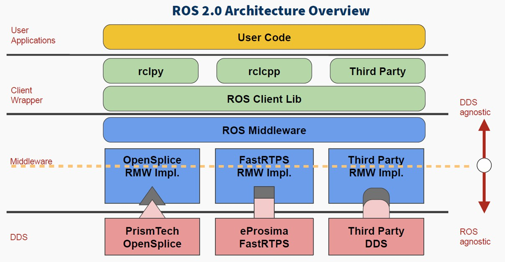

# ROS2

## 1. ROS2 基礎介紹

---

### 1-1. ROS 簡介

ROS（Robot Operating System）是一套為機器人開發所設計的中介軟體架構，  
提供常用工具與功能，例如通訊、硬體抽象、模組化架構等。

ROS2 每個[發行版（distro）](https://docs.ros.org/en/dashing/Releases.html)都對應特定的 Ubuntu 版本，  
建議選用 LTS（Long Term Support）版本以獲得較長的維護與穩定性。

| ROS2 Distro   | 支援 Ubuntu 版本      | LTS 支援期限         |
|---------------|----------------------|----------------------|
| Foxy          | 20.04 (Focal, LTS)   | 2023/05              |
| Galactic      | 20.04 (Focal, LTS)   | 2022/11              |
| Humble        | 22.04 (Jammy, LTS)   | 2027/05 (LTS)        |
| Iron          | 22.04 (Jammy, LTS)   | 2024/11              |
| Jazzy         | 24.04 (Noble, LTS)   | 2029/05 (LTS)        |

!!! tip "ROS Distro 選擇"

    開發專案優先選擇 ROS2 LTS 版本（如 Humble、Jazzy）及對應的 Ubuntu LTS 版本，以確保長期支援與相容性。

??? info "ROS1 vs. ROS2"

    ROS1 雖然廣泛使用，但在可靠性、安全性、即時性、多平台支援等方面有明顯限制。  
    ROS2 則是針對這些缺點進行重構，並導入了工業界標準的 DDS 架構。

    **ROS1 與 ROS2 的差異比較：**

    | 特性             | ROS1                          | ROS2                              |
    |------------------|-------------------------------|-----------------------------------|
    | 通訊機制         | 基於 TCP/UDP 自訂協定         | 基於 DDS 標準                     |
    | 多平台支援       | 僅支援 Linux 為主              | 支援 Linux、Windows、macOS       |
    | 實時性支援       | 不支援                         | 可透過 DDS 設定實現基本實時性    |
    | 安全性           | 幾乎無內建安全性               | DDS 提供加密與存取控制機制       |
    | 模組啟動與控制   | 不支援 Lifecycle               | 支援 Lifecycle 與狀態機           |

    雖然 ROS2 支援 Linux 以外的 OS， 但還是盡量跑在 Linux OS。

---

### 1-2. ROS2 核心概念

| 核心概念                | 說明                                                                 |
|-------------------------|--------------------------------------------------------------------|
| Node                | ROS2 中的最小運作單元，負責處理特定任務。                           |
| Topic            | 非同步資料流。</br>Publisher 與 Subscriber 用來傳送與接收資料。           |
| Service             | 同步通訊機制。</br>由 Client 發送請求、Server 回應。                      |
| Action             | 適合長時間執行的任務，具備回報中間狀態與取消的能力。                 |
| Publisher / Subscriber | 一對多或多對多的訊息發布與訂閱。                                 |
| tf2 座標轉換系統    | 管理多種坐標系之間的關係與轉換。                                    |
| Parameter           | 可在執行時動態設定與調整的變數。                                    |
| Lifecycle          | 提供節點生命週期管理的機制，有助於系統啟動與重啟控制。               |

---

### 1-3. ROS2 Middleware

{width="700"}

* **DDS (Data Distribution Service)**：

    - ROS2 的預設中介系統（例如 Fast DDS、Cyclone DDS 等）
    - 支援 QoS（Quality of Service）設定，如可靠性、延遲、保留歷史等
    - 分散式架構，不需中央 Master 管理

* **RMW（ROS Middleware Interface）層**：

    - 抽象層，提供 ROS2 與 DDS 的介接
    - 允許不同 DDS 實作（如 Fast DDS、RTI Connext）切換而不更改上層程式碼

---

## 2. 環境準備

!!! abstract "開發須知"

    所有的軟體都必須使用 Docker 開發，不要直接在 Host Machine 上安裝套件。

---

### 2-1. ROS2 Docker

首先是 ROS 官方提供的 Image 有以下幾種版本。  

學習階段，可以使用 `ros:humble-desktop-full` 避免缺少依賴套件的錯誤。  
但開發階段，考慮到 Docker 減肥，最好是從 `ros:<distro>-base` 開始安裝必要工具。


!!! info "ROS2 Official"

    | Image 名稱                  | 內容簡介                                                         | 適用情境                   |
    |-----------------------------|------------------------------------------------------------------|----------------------------|
    | `ros:<distro>-base`         | 僅含最基礎的 ROS 安裝                                            | 自訂需求、最小化映像檔     |
    | `ros:<distro>-core`        | 含開發工具與編譯器                                               | Package 開發               |
    | `ros:<distro>-desktop`      | 含 GUI 工具（如 RViz）                                           | 模擬、一般開發             |
    | `ros:<distro>-desktop-full` | 完整版本。</br>含模擬器（如 Gazebo）、範例套件等                    | 需要完整功能與模擬環境     |

??? info "ROS2 Official vs. osrf"

    除了官方 Image，也可以參考看看 osrf 的版本。

    | 項目                   | ROS 官方 Docker Image (`ros:`)             | OSRF Docker Image (`osrf/ros:`)            |
    |------------------------|--------------------------------------------|--------------------------------------------|
    | 維護單位               | Canonical & Open Robotics（官方）         | OSRF（Open Source Robotics Foundation）    |
    | Docker Hub 位置        | https://hub.docker.com/_/ros              | https://hub.docker.com/r/osrf/ros          |
    | 發布頻率               | 穩定、對齊 ROS 發布節奏                   | 有時會提前測試新版本                        |
    | 支援版本               | 全版本</br>（base、core、desktop、full）      | 部分以 `desktop` 為主，</br>也有 dev images     |
    | 安裝方式               | 使用 `apt` 安裝 ROS 套件                  | 有時使用 `rosinstall_generator` 或自建      |
    | 映像大小               | 較小（視版本而定）                        | 有時包含多餘 dev 工具，較大                |
    | 適合情境               | 正式開發與部署用                          | 測試、CI/CD、自訂構建需求                   |
    | 鏡像結構               | 基於 Ubuntu 官方映像構建                  | 有些版本是多階段構建，偏向開發用途          |
    | 文件與說明             | 官方 ROS Wiki、Docker Hub</br>說明完整        | 相對較少、需查 GitHub 或社群說明            |


!!! example "Checkpoint"

    選擇一個 ROS2 Docker Image，並且進入到 Container 內準備開發。  
    為了學習方便，請在 docker compose 中 volume 空資料夾到 container 內部：`~/colcon_ws:/root/colcon_ws` 。  
    如果不會操作，請回頭參閱 [docker-compose](http://localhost:8000/hrc-tech-docs/oweek/4.docker/#4-docker-compose)。

---

### 2-2. ROS2 Workspace 概念

ROS2 使用工作區（workspace）來管理程式碼與套件，最基本的結構如下：

``` yaml
ros2_ws/                # ROS2 工作區主目錄
├── build/              # （自動生成）colcon 建構中間產物（CMake build files）
├── install/            # （自動生成）安裝後的執行檔與設定檔（source 此資料夾以使用套件）
├── log/                # （自動生成）建構過程的日誌（編譯錯誤與輸出紀錄）
└── src/                # 原始碼放置處：放置 ROS2 packages
    ├── my_robot_pkg/   # 自訂或下載的 ROS2 package
    └── example_pkg/    # 可以有多個 ROS2 packages
```

再往下追溯到 ROS2 Package 的內部結構，也是遵循著一定的架構。  
ROS2 Package 可用 `C++` 或是 `Python` 語言撰寫，檔案架構上會有些許不同：

=== "📄 `C++ Package 架構`"

    ``` yaml
    cpp_robot_pkg/
    ├── CMakeLists.txt                  # ROS2 CMake 建構腳本，編譯與安裝規則定義
    ├── package.xml                     # ROS2 套件描述檔，宣告依賴、作者等資訊
    ├── launch/
    │   └── cpp_robot.launch.py         # 使用 Python 撰寫的啟動檔，啟動節點用
    ├── src/
    │   └── cpp_robot_node.cpp          # 節點主程式 (C++ 撰寫)，通常含 main()
    ├── include/
    │   └── cpp_robot_pkg/
    │       └── cpp_robot_node.hpp      # 對應的 C++ 標頭檔，定義類別與介面
    └── config/
        └── params.yaml                 # 參數檔，供節點在啟動時載入設定值
    ```

=== "📄 `Python Package 架構`"

    ``` yaml
    py_robot_pkg/
    ├── package.xml                 # ROS2 套件描述檔，宣告依賴、執行點、授權等
    ├── setup.py                    # Python 安裝腳本，宣告套件結構與 entry_points
    ├── setup.cfg                   # 補充設定檔，簡化 setup.py 的格式定義
    ├── resource/
    │   └── py_robot_pkg            # ament 所需，用來標示為可發佈套件（空檔即可）
    ├── py_robot_pkg/
    │   ├── __init__.py             # Python 套件初始化（可留空）
    │   └── py_robot_node.py        # 節點主程式 (Python 撰寫)，含 rclpy 程式碼
    ├── launch/
    │   └── py_robot.launch.py      # 啟動檔，定義如何啟動此 Python 節點
    └── config/
        └── params.yaml             # 參數設定檔，以 YAML 格式定義參數值
    ```

!!! warning "ROS2 編譯工具 colcon"
    
    注意以上文件中有很多是依靠 ROS2 的編譯工具 `colcon` 建立或編譯的產物，  
    因此請跟著步驟使用工具建立檔案，而不要自己徒手新增檔案，否則可能會編譯或執行錯誤。  

!!! example "Checkpoint"

    理解 Workspace 架構，並且能分辨 `workspace/src` 和 `package/src` 的差異。

---

## 3. ROS2 基礎功能實作

!!! abstract "實作內容"

    從乾淨的 ROS2 Workspace 搭建不同功能的 Node，並編譯、執行。

---

### 3-1. 建立 Workspace

!!! warning "你已經在 Container 內了嗎?"

    後續操作都是在 Docker Container 內執行，不要汙染到宿主機環境！

建立 Workspace 目錄：

``` yaml
mkdir -p ~/colcon_ws/src
src ~/colcon_ws
```

---

### 3-2. 撰寫 Publisher / Subscriber Node

1. 建立 Package，以下分為 C++ 和 Python 兩種版本：

    === "C++"

        ``` yaml
        # :~/colcon_ws$
        cd src
        ros2 pkg create --build-type ament_cmake py_pubsub --dependencies rclcpp std_msgs
        ```

    === "Python"

        ``` yaml
        # :~/colcon_ws$
        cd src
        ros2 pkg create --build-type ament_python py_pubsub --dependencies rclpy std_msgs
        ```

2. 撰寫 Publisher 和 Subscriber Node，也提供 C++ 和 Python 版本：

    !!! abstract

        talker 將定時發佈 message 到 topic 上面，並且由 listener 接收該 topic。

    === "C++"

        === "📄 `cpp_pubsub/src/talker.cpp`"

            ``` cpp linenums="1"
            #include "rclcpp/rclcpp.hpp"
            #include "std_msgs/msg/string.hpp"
            #include <chrono>

            using namespace std::chrono_literals;

            class Talker : public rclcpp::Node {
            public:
                Talker() : Node("talker_node") {
                    publisher_ = this->create_publisher<std_msgs::msg::String>("chatter", 10);
                    timer_ = this->create_wall_timer(500ms, std::bind(&Talker::timer_callback, this));
                }

            private:
                void timer_callback() {
                    auto msg = std_msgs::msg::String();
                    msg.data = "Hello, ROS2!";
                    RCLCPP_INFO(this->get_logger(), "Publishing: '%s'", msg.data.c_str());
                    publisher_->publish(msg);
                }

                rclcpp::Publisher<std_msgs::msg::String>::SharedPtr publisher_;
                rclcpp::TimerBase::SharedPtr timer_;
            };

            int main(int argc, char *argv[]) {
                rclcpp::init(argc, argv);
                rclcpp::spin(std::make_shared<Talker>());
                rclcpp::shutdown();
                return 0;
            }

            ```

        === "📄 `cpp_pubsub/src/listener.cpp`"

            ``` cpp linenums="1"
            #include "rclcpp/rclcpp.hpp"
            #include "std_msgs/msg/string.hpp"

            class Listener : public rclcpp::Node {
            public:
                Listener() : Node("listener_node") {
                    subscription_ = this->create_subscription<std_msgs::msg::String>(
                    "chatter", 10,
                    [this](const std_msgs::msg::String::SharedPtr msg) {
                        RCLCPP_INFO(this->get_logger(), "Received: '%s'", msg->data.c_str());
                    });
                }

            private:
                rclcpp::Subscription<std_msgs::msg::String>::SharedPtr subscription_;
            };

            int main(int argc, char *argv[]) {
                rclcpp::init(argc, argv);
                rclcpp::spin(std::make_shared<Listener>());
                rclcpp::shutdown();
                return 0;
            }
            ```
    === "Python"

        === "📄 `py_pubsub/src/talker.cpp`"

            ``` py linenums="1"
            import rclpy
            from rclpy.node import Node
            from std_msgs.msg import String

            class Talker(Node):
                def __init__(self):
                    super().__init__('talker_node')
                    self.publisher_ = self.create_publisher(String, 'chatter', 10)
                    self.timer = self.create_timer(0.5, self.timer_callback)

                def timer_callback(self):
                    msg = String()
                    msg.data = 'Hello from Python!'
                    self.get_logger().info(f'Publishing: "{msg.data}"')
                    self.publisher_.publish(msg)

            def main(args=None):
                rclpy.init(args=args)
                node = Talker()
                rclpy.spin(node)
                node.destroy_node()
                rclpy.shutdown()

            if __name__ == '__main__':
                main()

            ```

        === "📄 `py_pubsub/src/listener.py`"

            ``` py linenums="1"
            import rclpy
            from rclpy.node import Node
            from std_msgs.msg import String

            class Listener(Node):
                def __init__(self):
                    super().__init__('listener_node')
                    self.subscription = self.create_subscription(
                        String,
                        'chatter',
                        self.listener_callback,
                        10)

                def listener_callback(self, msg):
                    self.get_logger().info(f'Received: "{msg.data}"')

            def main(args=None):
                rclpy.init(args=args)
                node = Listener()
                rclpy.spin(node)
                node.destroy_node()
                rclpy.shutdown()

            if __name__ == '__main__':
                main()

            ```

3. 使用 `colcon` 工具編譯工作區。

    === "C++"

        ``` yaml
        cd ~/colcon_ws
        colcon build --packages-select cpp_pubsub --symlink-install
        ```

    === "Python"

        ``` yaml
        cd ~/colcon_ws
        colcon build --packages-select py_pubsub --symlink-install
        ```

    編譯完成後，使用 `source` 安裝環境：

    ``` yaml
    source install/setup.bash
    ```

4. 執行 ROS2 Node。

    開啟兩個 Terminal，分別執行 `talker` 與 `listener`：

    === "Terminal 1"

        運行 `talker` node。

        === "C++"

            ``` yaml
            ros2 run cpp_pubsub talker
            ```

        === "Python"

            ``` yaml
            ros2 run py_pubsub talker
            ```

    === "Terminal 2"

        運行 `listener` node。

        === "C++"

            ``` yaml
            ros2 run cpp_pubsub listener
            ```

        === "Python"

            ``` yaml
            ros2 run py_pubsub listener
            ```

5. topic 相關工具測試。

    | 指令                            | 說明                            |
    |----------------------------------|---------------------------------|
    | `ros2 topic list`               | 查看目前所有 topic 名稱         |
    | `ros2 topic echo /chatter`     | 監看 `/chatter` topic 的內容     |
    | `ros2 topic info /chatter`     | 顯示 topic 資訊（型別、pub/sub） |
    | `ros2 topic hz /chatter`       | 顯示訊息頻率                    |
    | `ros2 topic pub /chatter std_msgs/String "data: 'hello'"` | 手動發送一筆訊息                  |

---

### 3-4. 撰寫 Service / Client

1. 建立 Package，以下分為 C++ 和 Python 兩種版本：

    === "C++"

        ``` yaml
        # :~/colcon_ws$
        cd src
        ros2 pkg create --build-type ament_cmake cpp_srvcli --dependencies rclcpp example_interfaces
        ```

    === "Python"

        ``` yaml
        # :~/colcon_ws$
        cd src
        ros2 pkg create --build-type ament_python py_srvcli --dependencies rclpy example_interfaces
        ```

2. 撰寫 Service 和 Client Node，提供 C++ 和 Python 版本：

    !!! abstract

        `add_two_ints_server` 是一個服務節點，會接收兩個整數，並回傳它們的總和。
        `add_two_ints_client` 是一個用來呼叫該服務的節點，送出請求並顯示回傳的加總結果。

    === "C++"

        === "📄 `cpp_srvcli/src/add_two_ints_server.cpp`"

            ``` cpp linenums="1"
            #include "rclcpp/rclcpp.hpp"
            #include "example_interfaces/srv/add_two_ints.hpp"

            using AddTwoInts = example_interfaces::srv::AddTwoInts;
            using std::placeholders::_1;
            using std::placeholders::_2;

            class AddTwoIntsServer : public rclcpp::Node {
            public:
                AddTwoIntsServer() : Node("add_two_ints_server") {
                    service_ = create_service<AddTwoInts>(
                    "add_two_ints", std::bind(&AddTwoIntsServer::handle_add, this, _1, _2));
                }

            private:
                void handle_add(const std::shared_ptr<AddTwoInts::Request> request,
                                std::shared_ptr<AddTwoInts::Response> response) {
                    response->sum = request->a + request->b;
                    RCLCPP_INFO(this->get_logger(), "Received: %ld + %ld", request->a, request->b);
                }

                rclcpp::Service<AddTwoInts>::SharedPtr service_;
            };

            int main(int argc, char **argv) {
                rclcpp::init(argc, argv);
                rclcpp::spin(std::make_shared<AddTwoIntsServer>());
                rclcpp::shutdown();
                return 0;
            }

            ```

        === "📄 `cpp_srvcli/src/add_two_ints_client.cpp`"

            ``` cpp linenums="1"
            #include "rclcpp/rclcpp.hpp"
            #include "example_interfaces/srv/add_two_ints.hpp"

            using AddTwoInts = example_interfaces::srv::AddTwoInts;

            int main(int argc, char **argv) {
                rclcpp::init(argc, argv);
                auto node = rclcpp::Node::make_shared("add_two_ints_client");
                auto client = node->create_client<AddTwoInts>("add_two_ints");

                while (!client->wait_for_service(std::chrono::seconds(1))) {
                    RCLCPP_INFO(node->get_logger(), "Waiting for service...");
                }

                auto request = std::make_shared<AddTwoInts::Request>();
                request->a = 3;
                request->b = 7;

                auto result = client->async_send_request(request);
                if (rclcpp::spin_until_future_complete(node, result) 
                    rclcpp::FutureReturnCode::SUCCESS) {
                    RCLCPP_INFO(node->get_logger(), "Result: %ld", result.get()->sum);
                }

                rclcpp::shutdown();
                return 0;
            }
            ```

    === "Python"

        === "📄 `py_srvcli/srv/add_two_ints_server.py`"

            ``` py linenums="1"
            import rclpy
            from rclpy.node import Node
            from example_interfaces.srv import AddTwoInts

            class AddTwoIntsServer(Node):
                def __init__(self):
                    super().__init__('add_two_ints_server')
                    self.srv = self.create_service(AddTwoInts, 'add_two_ints', self.handle_add)

                def handle_add(self, request, response):
                    self.get_logger().info(f"Received request: {request.a} + {request.b}")
                    response.sum = request.a + request.b
                    return response

            def main(args=None):
                rclpy.init(args=args)
                node = AddTwoIntsServer()
                rclpy.spin(node)
                rclpy.shutdown()

            if __name__ == '__main__':
                main()
            ```

        === "📄 `py_srvcli/srv/add_two_ints_client.py`"

            ``` py linenums="1"
            import rclpy
            from rclpy.node import Node
            from example_interfaces.srv import AddTwoInts

            class AddTwoIntsClient(Node):
                def __init__(self):
                    super().__init__('add_two_ints_client')
                    self.client = self.create_client(AddTwoInts, 'add_two_ints')
                    while not self.client.wait_for_service(timeout_sec=1.0):
                        self.get_logger().info('Waiting for service...')
                    self.send_request()

                def send_request(self):
                    req = AddTwoInts.Request()
                    req.a = 3
                    req.b = 5
                    future = self.client.call_async(req)
                    rclpy.spin_until_future_complete(self, future)
                    if future.result():
                        self.get_logger().info(f'Result: {future.result().sum}')

            def main(args=None):
                rclpy.init(args=args)
                node = AddTwoIntsClient()
                rclpy.shutdown()

            if __name__ == '__main__':
                main()
            ```

3. 使用 `colcon` 工具編譯工作區。

    === "C++"

        ``` yaml
        cd ~/colcon_ws
        colcon build --packages-select cpp_srvcli --symlink-install
        ```

    === "Python"

        ``` yaml
        cd ~/colcon_ws
        colcon build --packages-select py_srvcli --symlink-install
        ```

    編譯完成後，使用 `source` 安裝環境：

    ``` yaml
    source install/setup.bash
    ```

4. 執行 ROS2 Node。

    開啟兩個 Terminal，分別執行 `add_two_ints_server` 與 `add_two_ints_client`：

    === "Terminal 1"

        運行 `add_two_ints_server` node。

        === "C++"

            ``` yaml
            ros2 run cpp_srvcli add_two_ints_server
            ```

        === "Python"

            ``` yaml
            ros2 run cpp_srvcli add_two_ints_client 1 2
            ```

    === "Terminal 2"

        運行 `add_two_ints_client` node。

        === "C++"

            ``` yaml
            ros2 run py_srvcli add_two_ints_server
            ```

        === "Python"

            ``` yaml
            ros2 run py_srvcli add_two_ints_client 1 2
            ```

5. service 相關工具測試。

    | 指令                            | 說明                            |
    |----------------------------------|---------------------------------|
    | `ros2 service list`               | 查看目前所有 topic 名稱         |
    | `ros2 service type /add_two_ints`     | 查詢服務型別     |
    | `ros2 interface show example_interfaces/srv/AddTwoInts`     | 查詢型別結構  |

---

### 3-5. 撰寫與使用 Action

* 撰寫 action server/client
* 使用 ros2 action 工具觀察
* 解釋 goal/cancel/result 機制與回呼

---

## 4. 建構進階 ROS2 專案架構

---

### 4-1. 撰寫多節點模組化專案

* 專案結構設計建議（如 pkg_a/, pkg_b/）
* 將 pub-sub, service, action 拆分為不同功能模組
* 使用 .msg, .srv, .action 自訂介面類型

### 4-2. 撰寫 Launch 檔

* Python launch file 格式與語法
* 引入多個節點與 namespace、參數
* 加入延遲啟動、條件啟動

### 4-3. 動態參數與 Lifecycle 管理

* 使用 ROS2 Parameter
* 引入 rclpy.parameter 管理設定
* 簡介 Lifecycle Node 概念與應用時機