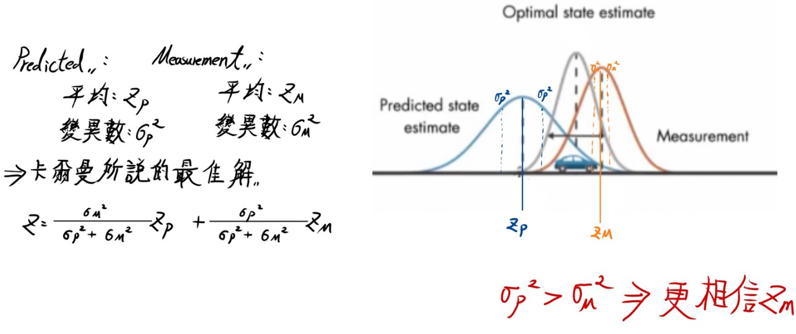
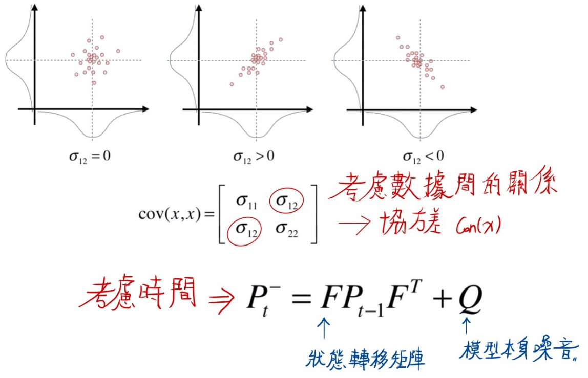

# 應用—基於Kalman Filter的機器人定位融合：ROS 2 模擬與 MATLAB 驗證

### 1 研究動機與目標

在進行機器人導航任務時，僅依賴單一來源（如里程計或定位系統）常因雜訊或延遲導致累積誤差。因此，有效整合不同頻率與特性的感測資料，是提升定位穩定度的關鍵手段。尤其在室內環境下，里程計數據具（odem）有高頻但易累積漂移，粒子濾波（如 AMCL）則提供較穩定的位置估計但更新頻率較低，因此兩者融合具明顯互補性。

在實務應用中，若能藉由濾波器即時整合兩種量測訊息，機器人將能即時修正定位偏差並平滑其軌跡，有助於精準導航、避障與任務執行。卡爾曼濾波器（KF）由於其數學簡潔、效能穩定，成為最常用的線性估測工具之一。在自主移動系統、車用控制、機器人決策模組等應用中，KF 皆扮演關鍵角色。透過合理設計狀態轉移模型與觀測模型，KF 可有效濾除感測雜訊並預測系統行為。

本研究結合ROS 2 與 MATLAB ，達成從理論推導到系統驗證的完整流程。透過 MATLAB 中純速度觀測的 KF 模擬，驗證演算法在有雜訊情境下的穩定性與準確度；而在 ROS 2 中，則利用 TurtleBot3 模擬平台結合 Gazebo 與 Navigation2，進行感測器資料的實時融合與視覺化，模擬實際應用中的情境。

本研究著眼於上述議題，具體目標為：

1. 以 **MATLAB** 二維常速（Constant‑Velocity, CV）KF 範例驗證 KF 對於速度觀測下的預測與修正能力，並分析其在純量測雜訊下的穩定性與收斂速度。
2. 在 **ROS 2 TurtleBot3** 模擬中實作卡爾曼濾波器（KF），評估融合 `/odom` 與 `/amcl_pose` 的效益，並以視覺化方式觀察其對軌跡平滑與漂移修正的影響

### 2 **理論基礎**

卡爾曼濾波器（Kalman Filter, KF）是一種用來預測與修正系統狀態的工具。可以把它想像成一個「會修正自己預測」的智能預測器。它一方面根據「系統模型」來預測下一個狀態，另一方面又會根據感測器實際觀測到的資料來修正這個預測值。

KF 的設計概念是這樣的：我們不盲目相信模型，也不完全依賴感測器，而是根據它們的可信度（即雜訊大小）來加權平均。也就是說，KF 是在「相信自己」與「聽別人說」之間做平衡的一種理性選擇。

如下圖所示，卡爾曼濾波的核心思想在於「相信誰，就加權誰多一點」。若模型預測（左圖）本身不準確，分布寬（變異數大），那麼 KF 就會更傾向相信觀測值（右圖），並讓最終估測值（中間藍灰分布）偏向觀測。圖中公式也說明了這個加權原理是依據變異數（σ²）來計算的，誰越不準（σ² 越大），所占的比例就越小。



舉個例子：你在夜間走路，手上拿著一張模糊的地圖（模型），偶爾能看到路標（感測器），KF 就像一位聰明的嚮導，能根據模糊的資訊不斷修正自己的位置估計。

KF 的運作流程可以分成兩大步驟：預測與更新。

- **預測階段**：
    - 根據前一時刻的估計與控制輸入，預測目前的狀態。
    - 同時估計這個預測值的「不確定程度」，也就是協方差。
- **更新階段**：
    - 接收到感測器的新資料，計算實際量測與預測的差距（這叫做創新量）。
    - 根據這個差距，結合預測與量測，得到一個新的估計值。

數學上，這些步驟如下：

1. 狀態預測：目前狀態 = 過去狀態 + 控制動作（例如速度 × 時間）
2. 協方差預測：不確定性根據系統模型累積
3. 計算卡爾曼增益：根據感測器與模型的不確定性計算權重
4. 狀態更新：預測值加上「修正量」
5. 協方差更新：新的不確定性會根據修正結果調整

KF 的特點是：它只需要上一時刻的資訊與目前感測值，不需要保存整個歷史紀錄，因此可以即時處理。這使得它特別適合用在像機器人這樣需要即時反應的場景。

此外，卡爾曼濾波的數學背景來自機率與統計理論。在理想狀況（線性系統、雜訊為高斯分佈）下，KF 是最準確的估測器。如果系統是非線性的，就可以用它的延伸版本：EKF（擴展卡爾曼濾波）或 UKF（無跡卡爾曼濾波）。卡爾曼濾波不只是一套數學公式，更是一種智慧地處理不確定性與模糊資訊的方法。它讓機器人能「邊走邊判斷」，即使環境中充滿雜訊，也能持續估計自己身處的位置與狀態。

我們可以以日常開車為例說明此概念：若車速設定為 60 km/h，要前往 60 km 路程，理論上預估需 1 小時；但實際行駛會因塞車、上坡下坡等因素導致實際位置與預期不同。這時若能搭配 GPS 每隔幾分鐘提供位置資訊，即可在預測之外加入實際量測，透過 KF 同時「相信模型」又「相信觀測」，動態取得較佳估計值。

KF 的重點是：誰的誤差大，就信誰少。例如：若模型可信但感測器雜訊大，KF 會偏重預測值；反之，若模型雜訊大但量測可靠，KF 會偏重修正量測。

下圖說明了 KF 在「預測」階段如何根據前一時刻的狀態估計與系統模型，推演新的協方差（Pₜ）。其中，協方差矩陣的非對角元素代表不同狀態變數之間的關聯性。KF 會在時間演進過程中，根據模型的不確定性（Q）與狀態轉移矩陣（F）計算新的不確定性區域，這些分布形狀就是 KF 的預測範圍。



KF 的數學實作基於兩大公式區塊：

- 預測階段：
    
    $$
    狀態預測：  x̂_k⁻ = A · x̂_{k-1} + B · u_k  
    $$
    
    $$
    協方差預測： P_k⁻ = A · P_{k-1} · Aᵀ + Q 
    $$
    
- 更新階段：

$$
卡爾曼增益： K_k = P_k⁻ · Hᵀ · (H · P_k⁻ · Hᵀ + R)⁻¹
$$

$$
狀態更新：  x̂_k = x̂_k⁻ + K_k · (z_k - H · x̂_k⁻)
$$

$$
協方差更新： P_k = (I - K_k · H) · P_k⁻
$$

KF 可視為一種狀態回授補償機制，具有時間演進與資訊融合的特性，在訊號受雜訊影響時仍能進行穩健估測，應用領域包含：

- 自駕車位置與速度融合
- 空中機器人之姿態與位置感測整合
- 機器人導航中 IMU + SLAM 的整合解

此外，卡爾曼濾波的數學推導來自最小均方誤差估測（MMSE），並可視為貝氏濾波器在高斯與線性假設下的最優解。當系統動態與量測皆可表示為線性關係時，KF 提供一種解析且可遞迴實現的最佳估測機制。

其基本假設為：

- 狀態轉移方程為線性，其中 w_k ~ N(0,Q) 為系統雜訊：

$$
x_k = A x_{k-1} + B u_k + w_k，
$$

- 量測方程為線性，其中 v_k ~ N(0,R) 為感測雜訊：

$$
z_k = H x_k + v_k
$$

KF 每次遞迴執行包含以下步驟：

1. 根據先前狀態進行狀態預測與協方差擴散（根據系統動態模型與雜訊估計）。
2. 接收新量測後，根據感測模型計算預測殘差與其協方差，並計算卡爾曼增益。
3. 利用量測殘差修正狀態與共變異數，完成更新。

卡爾曼增益本質上提供一個「信任程度」的加權比例，在動態模型與觀測模型之間進行折衷選擇。當量測不可靠（R 大）時，KF 傾向於依賴模型預測；當量測可信（R 小），則會強化即時修正。

### 3 程式設計與參數設置

### MATLAB 程式簡述：

本研究中使用的 MATLAB 程式 `kalman_cv_demo.m`，是一個用於模擬 2D 常速模型下卡爾曼濾波器的完整實驗。該程式模擬一個以固定速度在平面上移動的物體，並在每一時間步產生含高斯雜訊的速度觀測。透過卡爾曼濾波的預測與更新機制，逐步估算物體的位置與速度。

程式流程包含：

1. **參數設定**：包含時間間隔、真實速度、系統矩陣、觀測矩陣，以及過程與量測雜訊共變異數（Q 與 R）。
2. **初始條件設置**：狀態初始為零，協方差設為高值模擬不確定狀態。
3. **資料模擬**：生成帶雜訊的速度量測資料。
4. **KF 主迴圈**：包含每一步的預測與更新步驟，計算卡爾曼增益並修正狀態估計。
5. **結果視覺化**：以圖形方式同時呈現速度估測與 2D 空間軌跡。

此程式展示 KF 如何在單純速度量測下仍能還原穩定位置估計，提供理論面與實作面之交叉驗證。

### MATLAB 程式參數設置：

| 符號 | MATLAB 變數 | 數值／來源 | 備註 |
| --- | --- | --- | --- |
| F | A | [4×4 矩陣，dt = 0.1] | 狀態轉移矩陣（等速模型） |
| H | H | [2×4 矩陣，只觀測 vx, vy] | 量測矩陣 |
| Q | Q | G*G.'*σₐ²，σₐ = 0.5 | 過程雜訊共變異數 |
| R | R | 0.81 * eye(2)，σᵥ = 0.9 | 量測雜訊共變異數 |
| ẋ̂₀ | x | [0; 0; 0; 0] | 初始狀態 |
| P₀ | P | diag(1000, 1000, 1000, 1000) | 初始共變異數 |
| Kₜ | K | P * H.' / S （動態計算） | 卡爾曼增益（每一步更新） |
| ẋ̂ₜ⁻ | x (pred) | A * x | 先驗狀態（預測值） |
| Pₜ⁻ | P (pred) | A * P * A.' + Q | 先驗共變異數 |
| ẋ̂ₜ | x (upd) | x + K * (z – H * x) | 後驗狀態（更新後） |
| Pₜ | P (upd) | (I – K * H) * P | 後驗共變異數 |

### MATLAB 完整程式：

```matlab
%% kalman_cv_demo.m
% Constant‑Velocity Kalman Filter demo for 2‑D tracking
% (包含模擬、濾波與繪圖於同一檔)

clear; clc;

%% === 參數設定 ===
dt         = 0.1;      % 取樣週期 (s)
totalSteps = 200;      % 20 s @10 Hz
vx_true    = 20;       % 真實 X 速度 (m/s)
vy_true    = 10;       % 真實 Y 速度 (m/s)

%% === 系統矩陣 ===
A = [1 0 dt 0;
     0 1 0  dt;
     0 0 1  0;
     0 0 0  1];

H = [0 0 1 0;
     0 0 0 1];

G        = [0.5*dt^2; 0.5*dt^2; dt; dt];
sigma_a  = 0.5;                % 過程加速度雜訊標準差 (m/s^2)
Q        = (G*G.')*sigma_a^2;  % 過程雜訊共變異數矩陣

sigma_v  = 0.9;                % 量測雜訊標準差 (m/s)
R        = sigma_v^2*eye(2);   % 量測雜訊共變異數矩陣

%% === 初始狀態與共變異數 ===
x = zeros(4,1);                % [px; py; vx; vy]
P = diag([1000 1000 1000 1000]);
I = eye(4);

%% === 產生模擬量測資料 (高斯雜訊) ===
rng(0);  % repeatable
Z = [vx_true + sigma_v*randn(1,totalSteps);
     vy_true + sigma_v*randn(1,totalSteps)];

%% === 儲存估計 ===
X_est = zeros(4,totalSteps);

%% === Kalman Filter 主迴圈 ===
for k = 1:totalSteps
    % Prediction
    x = A*x;
    P = A*P*A.' + Q;

    % Update
    z = Z(:,k);
    S = H*P*H.' + R;
    K = P*H.'/S;          % Kalman Gain
    x = x + K*(z - H*x);  % 狀態修正
    P = (I - K*H)*P;      % 共變異數修正

    % 儲存
    X_est(:,k) = x;
end

%% === 繪圖 ===
t = (0:totalSteps-1)*dt;

figure('Name','Kalman Filter Velocity & Trajectory','Position',[100 100 800 600]);

subplot(2,1,1);
plot(t, Z(1,:), ':', 'DisplayName','Measured v_x'); hold on;
plot(t, Z(2,:), ':', 'DisplayName','Measured v_y');
plot(t, vx_true*ones(1,totalSteps), 'k--', 'DisplayName','True v_x');
plot(t, vy_true*ones(1,totalSteps), 'k-.', 'DisplayName','True v_y');
plot(t, X_est(3,:), 'LineWidth',1.5,'DisplayName','Estimated v_x');
plot(t, X_est(4,:), 'LineWidth',1.5,'DisplayName','Estimated v_y');
xlabel('Time (s)'); ylabel('Velocity (m/s)');
title('Velocity Estimation'); legend; grid on;

subplot(2,1,2);
plot(X_est(1,:), X_est(2,:), 'k.', 'DisplayName','Estimated Path'); hold on;
plot(X_est(1,1), X_est(2,1), 'go','DisplayName','Start');
plot(X_est(1,end), X_est(2,end), 'bo','DisplayName','Pred Goal');
plot(X_est(1,1)+dt*vx_true*totalSteps, X_est(2,1)+dt*vy_true*totalSteps, 'rx','DisplayName','Real Goal');
axis equal; grid on;
xlabel('x (m)'); ylabel('y (m)');
title('2‑D Trajectory'); legend;
```

### ros2系統模擬簡述：

此次撰寫的程式（4.所述之程式）具備下列核心功能：

1. **資料訂閱與接收**
    - 訂閱 `/odom` 主題（Odometry 訊息）：獲取機器人由里程計提供的位置資訊。
    - 訂閱 `/amcl_pose` 主題（PoseWithCovarianceStamped 訊息）：接收 AMCL（自適應蒙地卡羅定位）計算出的機器人即時位置。
2. **卡爾曼濾波（Kalman Filter）位置估測**
    - 對從里程計訊息加入隨機高斯噪音模擬感測誤差。
    - 使用二維位置 (x, y) 當作觀測輸入，進行 KF 預測與修正，估測較穩定的位置。
    - KF 狀態向量為 `[x, y, vx, vy]`，可估算平滑移動軌跡。
3. **即時視覺化**
    - 使用 Matplotlib 動態繪圖，持續更新顯示下列資訊：
        - 綠色：無噪音的里程計軌跡（Ground Truth）。
        - 藍色虛線：加入噪音的里程計數據。
        - 紅色：卡爾曼濾波估測的軌跡。
        - 紫色點：AMCL 當前定位點（修正後與 odom 起點對齊）。
4. **AMCL Offset 校正**
    - 初次收到 AMCL 資料時，會與 odom 初始點對齊，進行偏移修正，避免軌跡錯位。

### ros2系統模擬簡述：

| 符號／名稱 | Python 變數 | 數值／來源 | 說明 (中文) |
| --- | --- | --- | --- |
| dt | self.dt | 0.1 | 取樣週期 (秒) |
| F (A) | self.A | [[1, 0, dt, 0]; [0, 1, 0, dt]; [0, 0, 1, 0]; [0, 0, 0, 1]] | 狀態轉移矩陣（等速模型） |
| B | self.B | 4×2 全零矩陣 | 本範例不使用 cmd_vel 控制項 |
| H | self.H | [[1, 0, 0, 0]; [0, 1, 0, 0]] | 僅量測位置 (x, y) |
| Q | self.Q | 0.01 × I₄ | 過程雜訊共變異數 |
| R | self.R | 0.5 × I₂ | 量測雜訊共變異數 |
| x̂₀ | self.x | [[0], [0], [0], [0]] | 初始狀態 (x, y, vx, vy) |
| P₀ | self.P | I₄ | 初始共變異數 |
| Kₜ | K | P × Hᵀ × S⁻¹（動態計算） | 卡爾曼增益（每一步更新） |
| x̂ₜ⁻ | self.x | A × x（predict） | 先驗狀態 |
| Pₜ⁻ | self.P | A × P × Aᵀ + Q（predict） | 先驗共變異數 |
| x̂ₜ | self.x | x + K × (z – H x)（update） | 後驗狀態 |
| Pₜ | self.P | (I – K H) × P（update） | 後驗共變異數 |
| 噪音 σₓ | — | 0.05 | odom_callback 中加入 x 的高斯噪音 σ |
| 噪音 σᵧ | — | 0.05 | odom_callback 中加入 y 的高斯噪音 σ |

### ros2系統模擬完整步驟：

1.安裝ros2系統，本次實驗採用版本為humble（安裝過程參考下網頁）
https://docs.ros.org/en/humble/index.html

2.下載turtlebor3 package及設定其模擬環境（安裝過程參考下網頁）

https://emanual.robotis.com/docs/en/platform/turtlebot3/simulation/#gazebo-simulation

3.於Gazebo啟動turtlebor3模擬：

```bash
export TURTLEBOT3_MODEL=burger
ros2 launch turtlebot3_gazebo turtlebot3_world.launch.py
```

3.啟動導航功能及開啟rviz2：

```bash
export TURTLEBOT3_MODEL=burger
ros2 launch turtlebot3_navigation2 navigation2.launch.py use_sim_time:=True map:=$HOME/map.yaml
```

4.利用python完成卡爾曼濾波器的應用及結果紀錄（完整程式如下）

```python
#!/usr/bin/env python3
import rclpy
from rclpy.node import Node
from nav_msgs.msg import Odometry
from geometry_msgs.msg import PoseWithCovarianceStamped
import matplotlib.pyplot as plt
import numpy as np
from threading import Thread

class KalmanFilter:
    def __init__(self):
        self.dt = 0.1
        self.x = np.zeros((4, 1))  # [x, y, vx, vy]
        self.P = np.eye(4)
        self.A = np.array([[1, 0, self.dt, 0],
                           [0, 1, 0, self.dt],
                           [0, 0, 1, 0],
                           [0, 0, 0, 1]])
        self.B = np.zeros((4, 2))  # 不使用 cmd_vel 控制項
        self.H = np.array([[1, 0, 0, 0],
                           [0, 1, 0, 0]])
        self.Q = np.eye(4) * 0.01
        self.R = np.eye(2) * 0.5

    def predict(self):
        self.x = self.A @ self.x
        self.P = self.A @ self.P @ self.A.T + self.Q

    def update(self, z):
        y = z - self.H @ self.x
        S = self.H @ self.P @ self.H.T + self.R
        K = self.P @ self.H.T @ np.linalg.inv(S)
        self.x = self.x + K @ y
        self.P = (np.eye(4) - K @ self.H) @ self.P

    def get_position(self):
        return self.x[0, 0], self.x[1, 0]

class KFPathVisualizer(Node):
    def __init__(self):
        super().__init__('kf_path_visualizer')
        self.kf = KalmanFilter()

        self.odom_path = []          # 綠色標準值
        self.odom_noisy_path = []    # 藍色加入噪音
        self.kf_path = []            # 紅色 KF 路徑
        self.amcl_points = []        # 紫色即時點

        self.amcl_offset = None

        self.create_subscription(Odometry, '/odom', self.odom_callback, 10)
        self.create_subscription(
            PoseWithCovarianceStamped, '/amcl_pose', self.amcl_callback, 10)

        self.plot_thread = Thread(target=self.plot_loop)
        self.plot_thread.daemon = True
        self.plot_thread.start()

    def odom_callback(self, msg):
        x = msg.pose.pose.position.x
        y = msg.pose.pose.position.y
        self.odom_path.append((x, y))

        # 加入隨機高斯噪音
        noise_x = x + np.random.normal(0, 0.05)
        noise_y = y + np.random.normal(0, 0.05)
        self.odom_noisy_path.append((noise_x, noise_y))

        # 更新 KF，模擬使用 noisy odom
        self.kf.predict()
        z = np.array([[noise_x], [noise_y]])
        self.kf.update(z)
        kf_x, kf_y = self.kf.get_position()
        self.kf_path.append((kf_x, kf_y))

    def amcl_callback(self, msg):
        x = msg.pose.pose.position.x
        y = msg.pose.pose.position.y

        if self.amcl_offset is None and len(self.odom_path) > 0:
            odom_x, odom_y = self.odom_path[0]
            self.amcl_offset = (odom_x - x, odom_y - y)

        if self.amcl_offset:
            x += self.amcl_offset[0]
            y += self.amcl_offset[1]

        self.amcl_points.append((x, y))

    def plot_loop(self):
        plt.ion()
        fig, ax = plt.subplots()

        while rclpy.ok():
            ax.clear()
            if self.odom_path:
                x, y = zip(*self.odom_path)
                ax.plot(x, y, color='green', linewidth=1.0,
                        label='Odom (Ideal)')
            if self.odom_noisy_path:
                x, y = zip(*self.odom_noisy_path)
                ax.plot(x, y, color='blue', linestyle='--',
                        linewidth=1.0, label='Odom (Noisy)')
            if self.kf_path:
                x, y = zip(*self.kf_path)
                ax.plot(x, y, color='red', linewidth=1.0,
                        label='Kalman Filter')
            if self.amcl_points:
                x, y = zip(*self.amcl_points)
                ax.scatter(x, y, color='purple', s=6,
                           label='AMCL Pose', marker='x')

            ax.set_title('Robot Path Visualization')
            ax.set_xlabel('X')
            ax.set_ylabel('Y')
            ax.legend()
            ax.grid(True)
            plt.pause(0.1)

def main(args=None):
    rclpy.init(args=args)
    node = KFPathVisualizer()
    try:
        rclpy.spin(node)
    except KeyboardInterrupt:
        pass
    finally:
        node.destroy_node()
        rclpy.shutdown()

if __name__ == '__main__':
    main()

```

### 4 實驗結果分析（matlab對於卡爾曼濾波器的分析）

### 速度估計圖（如下圖）

- **Measured vₓ / vᵧ（虛線）**
    
    顯示大量雜訊，波動劇烈，特別是 vᵧ。
    
- **Estimated vₓ / vᵧ（實線）**
    
    幾乎貼近黑色真實速度線，曲線平滑穩定。
    
    → 表示 Kalman 濾波成功去除了觀測雜訊，估計結果非常準確。
    
- **估計收斂狀況**
    
    初期略有偏差，但在約 1 秒內快速收斂，之後緊貼真實速度線。
    

**總結：速度估計效果極佳，雜訊被大幅抑制，估計值穩定可靠。**


此圖為速度估計圖

---

### 2D Trajectory 圖（如下圖）

- **Estimated Path（黑點）**
    
    呈一直線，表示估計軌跡平滑、方向一致，未出現漂移或震盪。
    
- **Start（綠圈） vs. Real Goal（紅叉） vs. Pred Goal（藍圈）**
    
    藍圈幾乎與紅叉重疊，代表估計總移動距離與真實值非常接近。
    

**總結：路徑估計準確，終點預測精準，整體表現接近理想狀態。**


此圖為Trajectory 圖

---

### 整體結論

這次 Kalman 濾波在含高雜訊的速度量測下，成功實現：

- 速度估計平滑穩定且接近真值
- 位置軌跡直線筆直，方向與距離準確
- 初始幾步收斂快，後續誤差極小

### **5 實驗結果分析（卡爾曼濾波器於機器人位置判斷系統之實現）**

### 圖中路徑說明

| 顏色 | 意義 |
| --- | --- |
| **綠色實線** | `Odom (Ideal)` – 無雜訊的理想里程計路徑 |
| **藍色虛線** | `Odom (Noisy)` – 加入高斯雜訊的模擬里程計 |
| **紅色實線** | `Kalman Filter` – 使用藍線作為觀測值進行濾波估計的結果 |
| **紫色叉點** | `AMCL Pose` – 從 AMCL 得到的定位點（經校正後與里程對齊） |

---

### 結果分析

### 綠色 vs. 藍色：Odom 理想 vs. 有雜訊

- 藍色軌跡呈現明顯抖動，偏移原本平滑的綠色軌跡，尤其轉彎處更為明顯。
- 雖大致跟隨，但誤差大、穩定性差。

### 紅色 Kalman Filter 結果

- 線條比藍色平滑許多，誤差顯著縮小，幾乎回到綠色理想路徑附近。
- 轉彎處濾波效果仍良好，沒有出現抖動或偏移過大現象。
- 說明：**KF 成功從 noisy odom 中提取出穩定位置資訊。**

### 紫色 AMCL Pose

- 明顯集中於起點與終點兩個聚落（如圖中左上與右下），可能是由於靜止時才發生更新（AMCL 通常隨粒子聚合而跳動）。
- 大致上落在紅線（Kalman 結果）附近，表示 KF 結果與粒子濾波的結果是協調一致的。

---

### 總結

| 評估項目 | 結論 |
| --- | --- |
| 雜訊抑制 | Kalman 濾波有效去除藍線中明顯的隨機雜訊 |
| 路徑準確度 | 紅線估計路徑緊貼綠色理想路徑，具高準確性 |
| 穩定性 | 順暢平滑，特別是在轉彎處表現優異 |
| 與 AMCL 一致性 | 紅線與紫點分布重疊，結果一致 |

**整體而言，Kalman 濾波顯著提升了機器人定位的穩定性與準確性，是 noisy odometry 下的理想處理策略。**


此圖為卡爾曼濾波器於機器人位置判斷系統之實現結果

完整測試影片：https://drive.google.com/file/d/1-dBSuKQKii4JJ5n_O5uY7yrHfYTMV6YC/view?usp=drive_link

### **6 參考資料**

1. **Kalman, R. E.** (1960). *A New Approach to Linear Filtering and Prediction Problems*. Transactions of the ASME – Journal of Basic Engineering, 82(1), 35–45.
2. **Thrun, S., Burgard, W., & Fox, D.** (2005). *Probabilistic Robotics*. MIT Press.
3. **Bar-Shalom, Y., Li, X. R., & Kirubarajan, T.** (2001). *Estimation with Applications to Tracking and Navigation: Theory Algorithms and Software*. Wiley-Interscience.
4. **Welch, G., & Bishop, G.** (1995). *An Introduction to the Kalman Filter*. University of North Carolina at Chapel Hill.
    
    https://www.cs.unc.edu/~welch/media/pdf/kalman_intro.pdf
    
5. **ROS 2 官方文件**
    
    https://docs.ros.org/
    
6. **TurtleBot3 ROS 2 Simulation 教學**
    
    https://emanual.robotis.com/docs/en/platform/turtlebot3/simulation/
    
7. **MATLAB Documentation – Kalman Filter Design**
    
    https://www.mathworks.com/help/control/ref/kalman.html
    
8. **Notion-Friendly LATEX to Plain Text Math Reference (for fallback)**
    
    https://katex.org/docs/supported.html