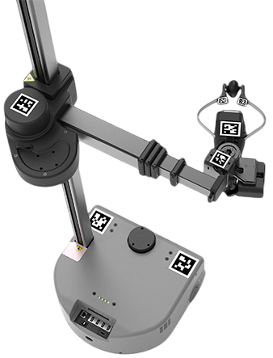
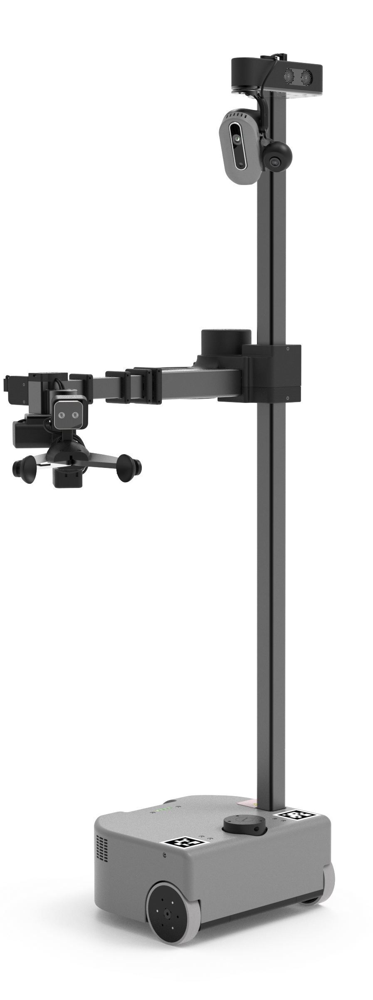
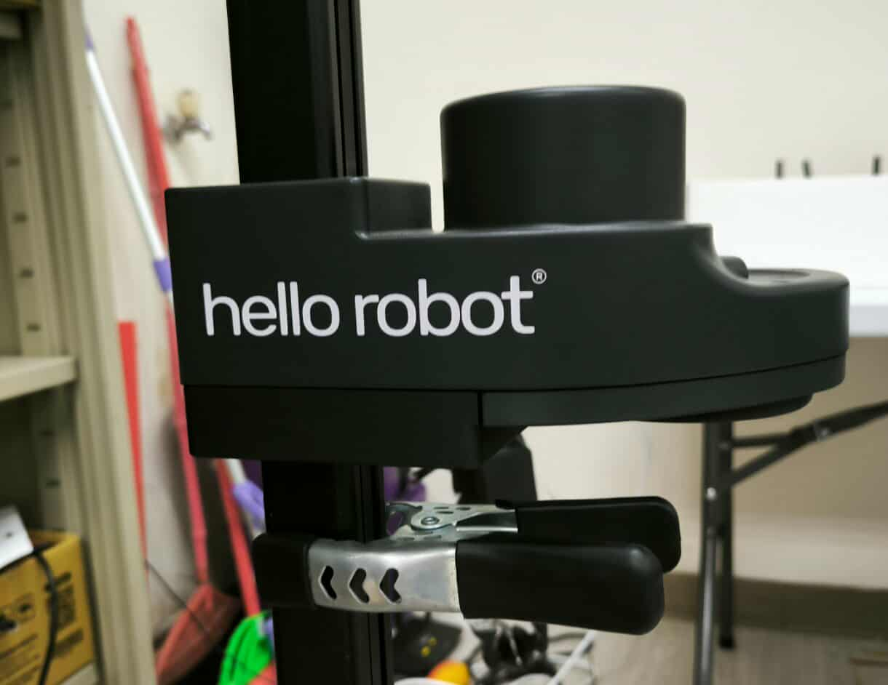
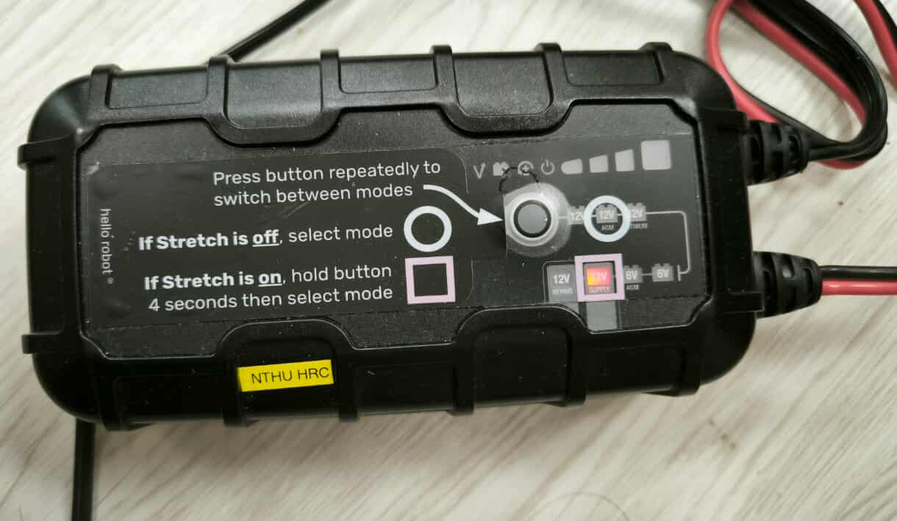
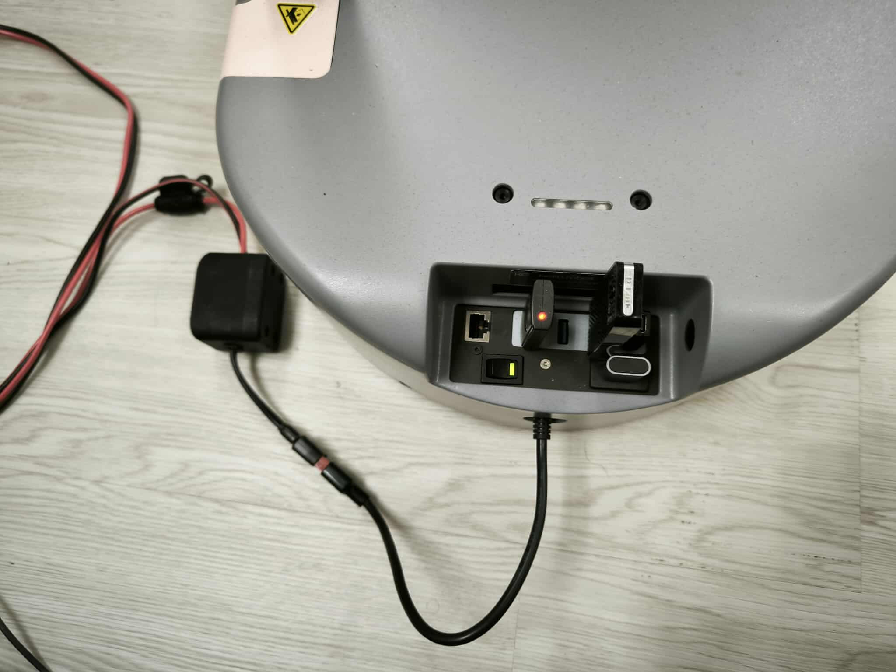
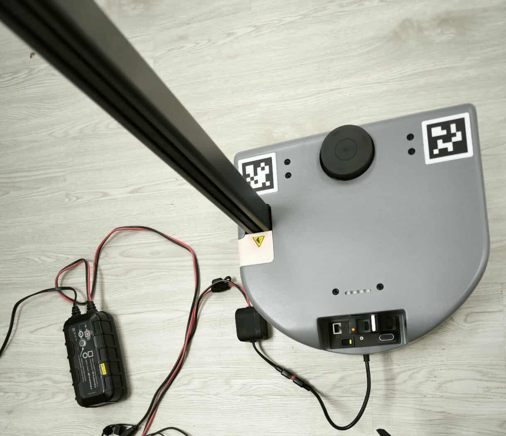

# Hello Robot Stretch 3

{ width=380px } 
&nbsp;&nbsp;&nbsp;&nbsp;&nbsp;&nbsp;&nbsp;&nbsp;&nbsp;
&nbsp;&nbsp;&nbsp;&nbsp;&nbsp;&nbsp;&nbsp;&nbsp;&nbsp;
&nbsp;&nbsp;&nbsp;&nbsp;&nbsp;&nbsp;&nbsp;&nbsp;&nbsp;
{ width=200px } 

---

## 1. Hardware

???+ warning "手臂固定夾"
    下電後手臂可能會下滑墜落，請在關機前使用固定夾咬住手臂下端，防止撞擊底盤。

    {width="500px"}

???+ warning "電池注意事項"
    根據指示短按或長按按鍵，直到亮紅燈如圖所示的位置，再接上 Stretch3 機器。

    {width="500px"}

??? info "機器開關"

    黃色那側按下去是開機。  
    
    {width="500px"}

??? info "接線示意圖"

    

---

## 2. Software