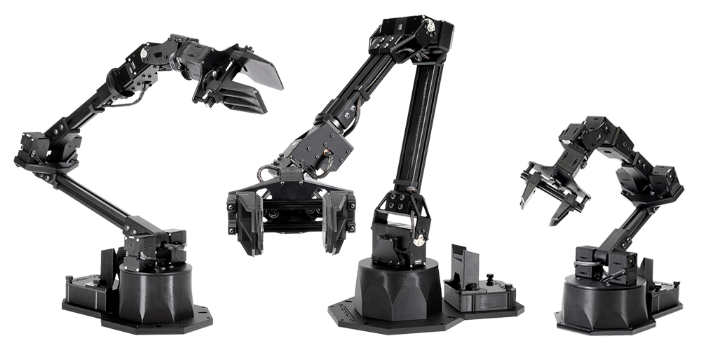
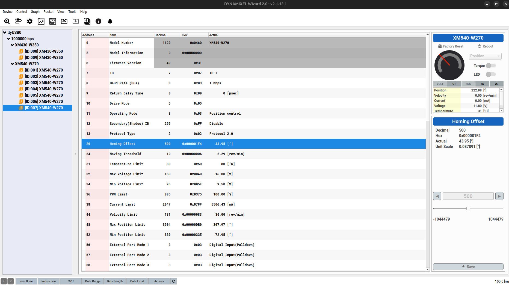
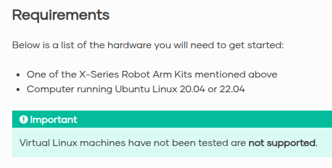

# Interbotix ViperX300s



## 1. Setup

---

### 1-1. Motors

- 底座的 U2D2 是 Dynamixel 客製化的 USB 介面轉換器，只負責通訊，不含電力。
- 所使用的馬達皆為 Dynamixel，須要用 Dynamxiel Wizard 2.0 調整參數。
    
        
- 沒外部供電或供錯電，馬達就無法被 Dynamixel Wizard 識別。
- 馬達能被 Dynamxiel Wizard 識別後才能開始對接 ROS2。

---

### 1-2. Motor Recovery

> Documentation:
> [How To: Firmware Recover DYNAMIXEL Using U2D2](https://www.youtube.com/watch?v=PgbIAK2Qg1Y)

如果 Dynamixel Wizard 無論如何都偵測不到馬達，有可能是馬達出廠後還沒做 recovery。

注意事項：

- 理論上 recovery 只須要做一次，後續都能被識別。
- recover 時必須單獨燒錄馬達， 不可串連。
- 在 recover 階段須要配置好每個馬達的 ID，若串連的馬達有相同 ID，其中一者會被忽略。

實驗室剛收到手臂時發現此問題，只好拆解整隻手臂，斷開馬達電路，個別燒錄。
p.s 會腰酸背痛手抽筋

---

### 1-3. Docker Image

> Documentation:
> 
> 
> [ROS 2 Standard Software Setup — Interbotix X-Series Arms Documentation](https://docs.trossenrobotics.com/interbotix_xsarms_docs/ros_interface/ros2/software_setup.html)
> 

根據官網，目前還不支援使用 Docker。



因此以下階段皆使用實驗室包的 Docker 做開發。
等我優化完會丟到 HRC 的 Docker Hub。 (by pomelo925)

## 2. Test & Calibration

---

> Documentation:
> 
> 
> [Arm Control — Interbotix X-Series Arms Documentation](https://docs.trossenrobotics.com/interbotix_xsarms_docs/ros2_packages/arm_control.html#)
> 

### 2-1. ROS2 API Testing

注意 Dynamixel Wizard 和 ROS2 Node 都會使用到 USB Port，同時間只能擇一。
使用 ROS2 前記得先在 Dynamixel Wizard 中 Disconnect。

- 實體的 ViperX 連線時，運行此命令會鎖定手臂，並呈現姿態於 RViz 中。
    
    ```bash
      ros2 launch interbotix_xsarm_control xsarm_control.launch.py robot_model:=vx300s
    ```
    
    - 務必先確認 RViz 中的姿態是否和現實中一樣，有異則須手動校正。
    - 在 RViz 中的 Robot Namespace 輸入 `vx300s` ，Group Name 選擇 `Arm`。
    可以控制是否開啟 `torque` 以及切換姿態模式 `sleep_position` 或 `home_position`。

### 2-2. Calibration Guide

> 如果手臂在 RViz 和現實中姿態不一樣，就要做校正。

由於官方和社群都沒校正資料，官方的 ROS2 Wrapper 又挺抽象的，
目前只能依照個人經驗，歸納一下 Calibration 的心得。
> 

要連續比對三個地方：

- **Dynamxiel Wizard 2.0**: 調整 `homing_offset`。
- **`interbotix_xsarm_control/config/vx300s.yaml`:** 調整 `Drive_Mode`。
- **RViz**: 觀察現實和模擬畫面。

<aside>
⚠️

注意到 `yaml` 中有這段，從屬馬達會被程式校正到和主動馬達同個角度。
校正角度會被丟到 EEPROM，可斷電記憶參數。所以不需要校正它們。

```yaml
shadows:
  shoulder:
    shadow_list: [shoulder_shadow]
    calibrate: true
  elbow:
    shadow_list: [elbow_shadow]
    calibrate: true
```

</aside>

<aside>
✅

`yaml` 下方 `motors` 的定義，會覆寫原先在 Dynamixel Wizard 上面的設定。
另外 `yaml` 更改後，須要做編譯 `colcon build --cmake-clean-cache`。

</aside>

流程（依照 ID 順序重複此步驟， 直至所有馬達校正完成）：

1. 開 ROS2 Node，記住 RViz 和實體的角度差。
2. 取消 Torque，手動旋轉馬達，觀察旋轉方向是否一致。
3. 若一致：跳到下一步。
若不一致：將 .`yaml` 的 Drive_Mode 改為 `0` 或 `1` (正反方向)，改完重回第一步。
shoulder_shadow 和 elbow_shadow 若須改則要一同改。
4. 如果角度差：
    - 小於 90 度
        1. 關閉 ROS2 Node，連接 Dynamixel Wizard 2.0。
        2. 調整 `homing_offset` 並 save 。單位換算：1 degree ~ 11.37778。 
        3. Dynamixel Wizard 中 Disconnect，開啟 ROS2 Node 看 RViz。
        4. 如此反覆，調整 `homing_offset` 正負和大小直到滿意。
    - 大於 90 度
        1. 根據 [Dynamixel X - C2.4.10. Homing Offset(20)](https://idminer.com.tw/docs/dynamixel-xc/xc430-w240/)，
        因為 ROS2 會設置 `Operateing Mode` 皆為 `Position Control`（不在 `yaml` 裡），
        所以 `homing_offset` 只能在正負 90 度之間調整。
        2. 拆卸機構和馬達，保持上電的情況下，手動旋轉馬達舵機盤 90~180 度。
        3. 鎖緊機構後再回到第一步。